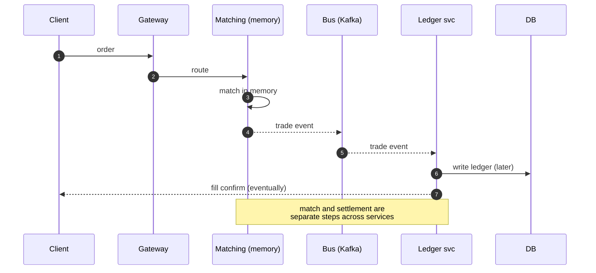
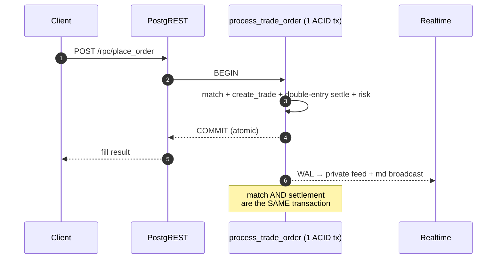
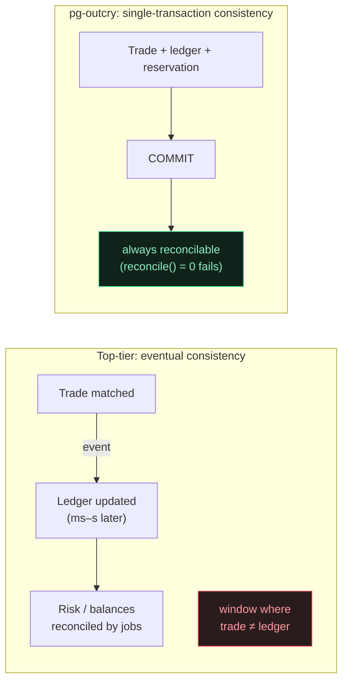
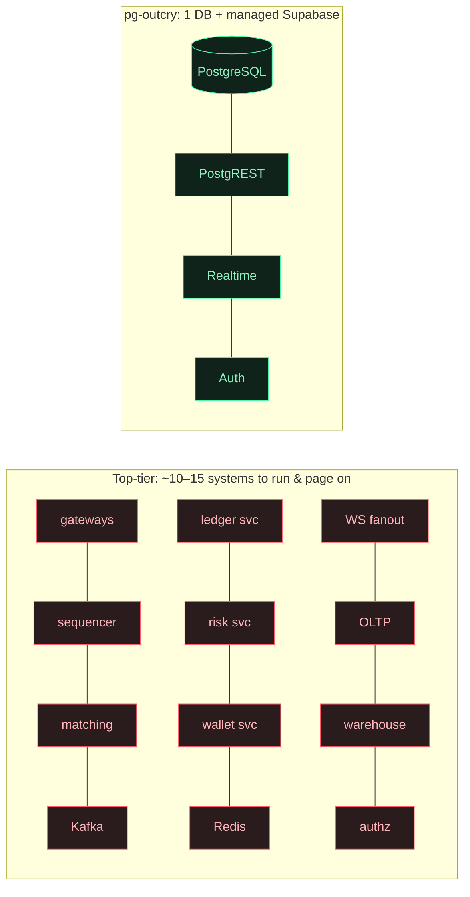
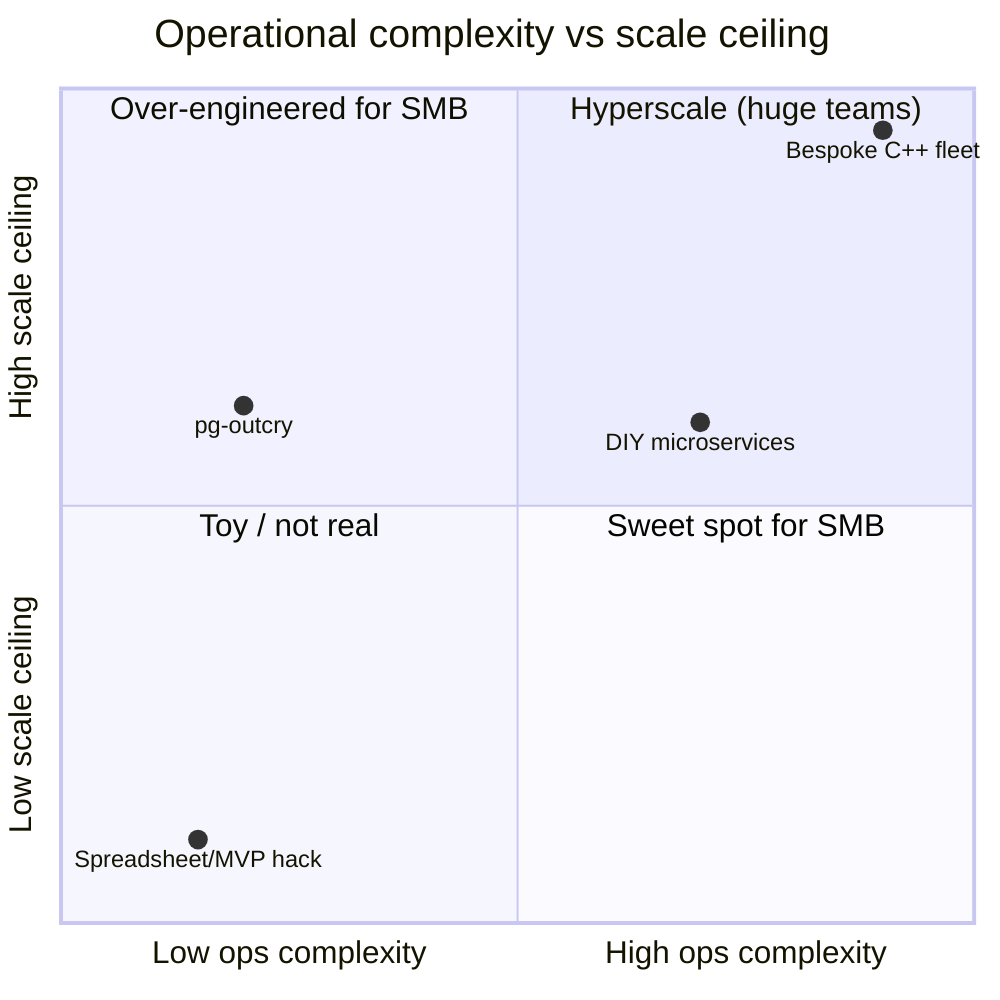

# Why pg-outcry · 为什么选 pg-outcry

**Architecture, the top-tier-exchange comparison, and the small/mid-size-exchange advantage.**
**架构剖析 · 与顶级交易所技术栈对比 · 中小交易所的巨大优势。**

[← Back to README](./README.md)

---

## 1. Two architectures, side by side / 两种架构对照

A top-tier exchange (Binance / Coinbase / Kraken-class) is a **fleet of specialized services** wired together by a message bus, tuned for microsecond latency and millions of orders/sec.

顶级交易所（币安 / Coinbase / Kraken 级别）是**一支由消息总线串起来的专用服务集群**，为微秒级延迟和每秒百万级订单而生。

```mermaid
flowchart TB
  subgraph TopTier["Top-tier exchange — a distributed fleet"]
    direction TB
    GW["FIX / REST / WS gateways"] --> SEQ["Sequencer"]
    SEQ --> ME["In-memory matching engine<br/>(C++, per-symbol, Disruptor)"]
    ME --> BUS{{"Message bus<br/>Kafka / Aeron"}}
    BUS --> MD["Market-data publishers"] --> WSF["WS fan-out gateways"]
    BUS --> LED["Settlement / ledger service"]
    BUS --> RSK["Risk engine"]
    BUS --> WAL["Wallet / funding service"]
    LED --> ODB[("OLTP DB")]
    WAL --> ODB
    RSK --> CACHE[("Redis cache")]
    LED --> DWH[("Warehouse")]
    ME -.journaling.-> JRNL[("Journal + snapshots<br/>for crash replay")]
  end
  style ME fill:#1c2b22,stroke:#4ef7a8
  style BUS fill:#2a1c1c,stroke:#ff5d6c
```

pg-outcry collapses that fleet into **one database plus Supabase's managed services**. The matching engine, ledger, and risk are PL/pgSQL functions; durability, ACID, and crash recovery are the database's job.

pg-outcry 把这支集群收敛成**一个数据库 + Supabase 托管服务**。撮合、账本、风控都是 PL/pgSQL 函数；持久化、ACID、崩溃恢复交给数据库本身。

```mermaid
flowchart TB
  subgraph PG["pg-outcry — one database is the exchange"]
    direction TB
    PR["PostgREST<br/>(RPC + views)"] --> FN
    RT["Realtime<br/>(broadcast + RLS feed)"] --- WALX[("WAL")]
    AU["Auth / GoTrue"] --- DB
    subgraph DB["PostgreSQL"]
      FN["process_trade_order()<br/>match + settle in ONE ACID tx"] --> LEDG["double-entry ledger<br/>(append-only)"]
      FN --> RISK["risk checks"]
      FN --> BOOK["price_level / book_order<br/>(UNLOGGED, in-memory)"]
      LEDG --> WALX
    end
  end
  CL["Browser — WASM terminal + admin"] -->|/rpc| PR
  CL -->|md:&lt;symbol&gt; · private feed| RT
  CL -->|OAuth2| AU
  style FN fill:#1c2b22,stroke:#4ef7a8
```

---

## 2. The order lifecycle / 一笔订单的生命周期

The difference is starkest when you trace one order. The top-tier path crosses many services; **correctness becomes a distributed problem** (the trade is matched in memory, then the ledger catches up via events).

把一笔订单追下来，差别最刺眼。顶级交易所要穿过许多服务，**正确性成了分布式问题**（先在内存里撮合，账本再通过事件追上）。

In pg-outcry the entire match **and** double-entry settlement happen inside **one database transaction**. When the RPC returns, the trade and the money have moved together — atomically — or not at all.

在 pg-outcry 里，整个撮合**和**双边记账结算发生在**同一个数据库事务**里。RPC 一返回，成交与资金已经**原子地**一起完成 —— 要么都成,要么都不成。

---

## 3. Consistency model / 一致性模型

> At scale, the eventual-consistency window is a *feature* (throughput). For a small/mid exchange it is mostly a *liability* — it's where the "trade booked but balance wrong" support tickets and audit findings come from. pg-outcry removes the window entirely.
>
> 在大规模场景，最终一致的"窗口"是为吞吐换来的*特性*；对中小交易所它多半是*负担* —— "成交了但余额不对"的工单和审计问题就出在这里。pg-outcry 直接消灭了这个窗口。

---

## 4. Why not their tech stack? / 为什么不用他们的技术栈？

Each piece of a top-tier stack solves a **scale** problem. At small/mid scale it mostly adds **cost and failure surface**.

顶级技术栈的每个组件都在解决**规模**问题。在中小规模，它们带来的多半是**成本与故障面**。

| Their component / 他们的组件 | Why it exists at scale / 大规模为何需要 | Why it's a liability for SMB / 对中小所为何是负担 | pg-outcry instead / 我们的做法 |
|---|---|---|---|
| **In-memory C++ engine** 内存撮合引擎 | µs latency, millions ops/s | needs custom journaling, snapshots, replay, failover — months of work | PL/pgSQL match; the DB gives ACID + durability + recovery for free / 数据库自带 ACID 与恢复 |
| **Kafka / Aeron bus** 消息总线 | decouple services, replay streams | another distributed system to run; **introduces eventual consistency** | one transaction; Realtime reads the WAL / 单事务，Realtime 直接读 WAL |
| **Redis cache** 缓存 | balances/book live outside the DB | cache-invalidation bugs; another HA system | hot data is `shared_buffers` + UNLOGGED tables in the same DB / 热数据就在同库内存 |
| **Ledger / risk / wallet microservices** 账本/风控/钱包微服务 | independent scaling | N deploys, N on-call, distributed transactions / sagas | functions in one schema, one transaction / 同库函数、同事务 |
| **Bespoke authz layer** 自研鉴权 | per-tenant isolation | a whole service to build & secure | Postgres **RLS** — zero custom authz code / RLS 零自研鉴权 |
| **WS fan-out fleet** WS 推送集群 | millions of subscribers | infra + scaling to operate | Supabase Realtime, RLS-scoped, managed / 托管的 Realtime，RLS 限定 |

**The throughput a top-tier stack buys is real — and irrelevant if you trade thousands (not millions) of orders/sec.** You'd be paying the full operational price of hyperscale to serve a fraction of the load.

**顶级栈换来的吞吐是真的 —— 但当你每秒几千（而非百万）笔订单时，它毫无意义。** 你等于在用超大规模的全部运维代价，去服务很小的一部分流量。

---

## 5. Moving parts & failure surface / 组件数与故障面

Fewer parts → fewer failure modes → fewer people on call → lower cost. Every box you don't run is a box that can't page you at 3am.

组件越少 → 故障模式越少 → 值班的人越少 → 成本越低。**你不运行的每一个盒子，都不会在凌晨三点把你叫醒。**

---

## 6. Cost & team to operate / 运营成本与团队

A bespoke fleet sits top-right (huge scale, huge ops). pg-outcry sits in the **SMB sweet spot**: low operational complexity with a scale ceiling that comfortably covers small and mid-size venues — and a documented path to push the ceiling higher when needed (§8).

定制集群在右上角（大规模、大运维）。pg-outcry 落在**中小所甜区**：低运维复杂度，同时其规模上限足以从容覆盖中小交易所 —— 并且有明确的提升上限的路径（见 §8）。

---

## 7. The small/mid-size advantage, in depth / 中小交易所优势详解

### 7.1 Operations & cost / 运维与成本
One PostgreSQL + Supabase. No brokers, caches, or service mesh. Runs on a managed Supabase project or a single VM; **one or two engineers** operate the entire exchange. You pay for one system, not a fleet.
一个 PostgreSQL + Supabase。没有消息队列、缓存、服务网格。一个托管 Supabase 项目或一台 VM 即可；**一两个工程师**运营整个交易所。你为一套系统付费，而不是一支集群。

### 7.2 Time to market / 上线速度
`supabase db reset` applies the schema; open the included terminal and admin console. You start with a **working exchange**, not an integration project. Days, not quarters.
`supabase db reset` 装上 schema，打开内置终端与后台 —— 你拿到的是一个**能跑的交易所**，不是一个集成项目。按天，而非按季度。

### 7.3 Correctness you didn't have to build / 不用自己造的正确性
Double-entry ledger, fund reservation/freeze, idempotent deposits/withdrawals, single-transaction settlement, append-only ledger, per-user RLS — the financial-integrity work that sinks small teams is done and tested.
双边记账、资金冻结、幂等充提、单事务结算、只追加账本、用户级 RLS —— 这些能拖垮小团队的金融正确性工作，已做好并测试。

### 7.4 Compliance & trust scaffolding / 合规与信任脚手架

```mermaid
flowchart LR
  TX["every trade / transfer"] --> L["append-only<br/>double-entry ledger"]
  L --> R["reconcile()<br/>5 invariants"]
  ADM["admin action"] --> AUD["audit log"]
  L --> RPT["balances always<br/>re-derivable"]
  R --> OK{{"0 fails = books balance"}}
  style OK fill:#10231a,stroke:#4ef7a8
```

Append-only ledger + continuous reconciliation + admin audit log + account suspension + per-instrument risk limits = the controls auditors and banking partners ask about, built in.
只追加账本 + 持续对账 + 管理审计 + 账户冻结 + 按品种风控 = 审计方与银行合作方会问到的控制项，开箱即有。

### 7.5 Realtime & UX without a team / 没有团队也有实时与体验
Public market data (coalesced L2 + tape) over Broadcast; each user's private order/fill/wallet stream over RLS-scoped Postgres Changes — **no relay server, no per-user topic plumbing**. The included WASM terminal already renders candles + full TA + drawing tools client-side.
公共行情（合并 L2 + 成交带）走广播；每个用户的私有订单/成交/钱包流走 RLS 限定的 Postgres Changes —— **无中继服务、无按用户布线**。内置 WASM 终端已在前端渲染蜡烛 + 全套指标 + 画线工具。

### 7.6 Inspectable, no lock-in / 可审计、无锁定
Matching and settlement are plain SQL you can read, fork, and audit. No black-box engine binary, no proprietary protocol.
撮合与结算是你能读、能 fork、能审计的纯 SQL。没有黑盒引擎二进制、没有私有协议。

---

## 8. "Won't we outgrow it?" — the scaling path / "会不会很快撑不住？"——扩展路径

You grow **along one axis at a time**, without rewrites:

你**沿单一维度逐步扩展**，无需重写：

```mermaid
flowchart LR
  S1["① Hosted Supabase<br/>demo → production"] --> S2["② Self-host high-perf<br/>UNLOGGED book · WAL tuning<br/>native C hot-path"]
  S2 --> S3["③ Shard by symbol<br/>1 project per symbol set<br/>stateless router"]
  S3 --> S4["④ Read replicas for<br/>market data / analytics"]
  style S1 fill:#10231a,stroke:#2a8f63
  style S2 fill:#10231a,stroke:#4ef7a8
  style S3 fill:#11202b,stroke:#5ad8ff
  style S4 fill:#1a1626,stroke:#9b8cff
```

Per-symbol concurrency is already there (advisory locks): different symbols never block each other. Because **a CEX has no cross-symbol transactions**, sharding by symbol across nodes is clean and needs **zero schema change** — each shard is the identical migration set owning a disjoint symbol set, behind a stateless router, with a shared identity/wallet plane.

按 symbol 的并发已经具备（advisory lock）：不同品种互不阻塞。由于 **CEX 不存在跨 symbol 事务**，按 symbol 跨节点分片很干净、**零 schema 改动** —— 每个分片是同一套迁移、各自拥有互不相交的品种集合，前置无状态路由，共享身份/钱包平面。

---

## 9. When NOT to use this / 什么情况下别用它

Honesty builds trust. If you need **sub-100µs matching**, **millions of orders/sec on a single symbol**, or **co-located HFT** market structure, build a bespoke in-memory engine — that's what the top-tier stack is *for*.

诚实建立信任。如果你需要 **亚 100µs 撮合**、**单品种每秒百万级订单**、或**主机托管 HFT** 市场结构，请上定制内存引擎 —— 顶级技术栈正是*为此而生*。

pg-outcry targets the **vast majority of venues that aren't that**: regional and retail exchanges, altcoin/spot venues, brokerage matching, prediction & simulation markets, and new exchanges that need to launch correct, compliant, and cheap — then scale deliberately.

pg-outcry 面向**绝大多数并非如此的场景**：区域所与零售所、山寨币/现货所、券商撮合、预测/模拟市场，以及需要"正确、合规、低成本"先上线、再有节奏地扩展的新交易所。

**Exchange-grade correctness, realtime, and compliance — at the complexity and cost a small team can actually carry.**
**交易所级的正确性、实时性与合规 —— 用小团队真正扛得住的复杂度和成本。**

[← Back to README](./README.md)

