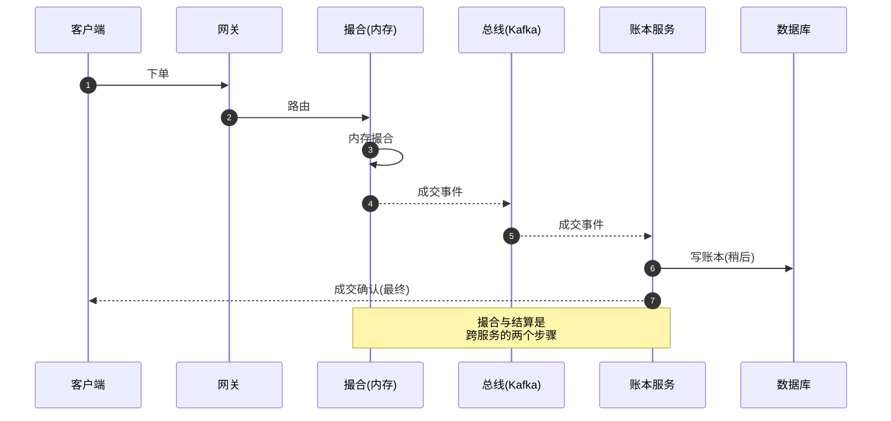
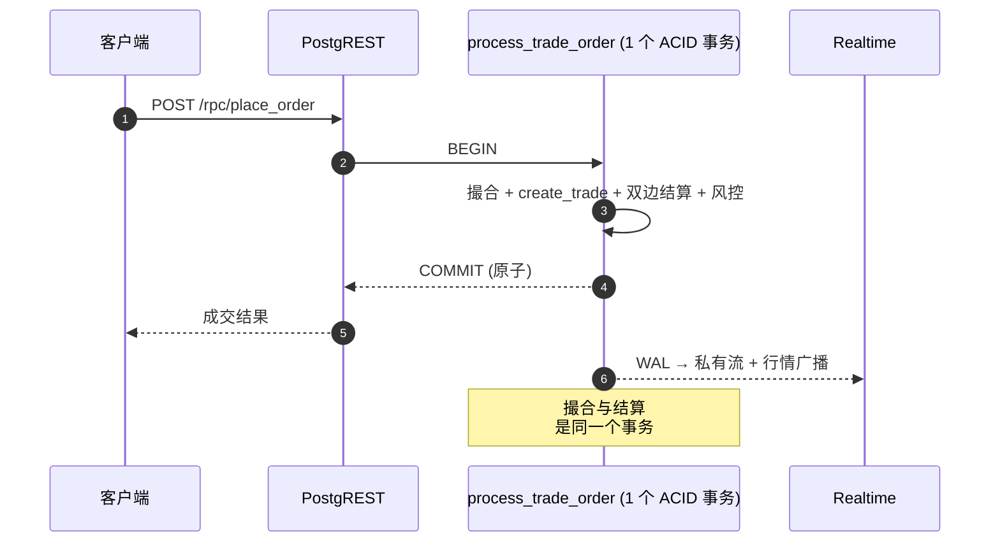
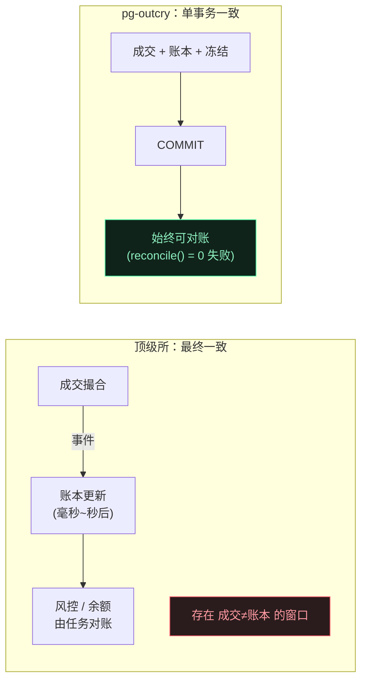
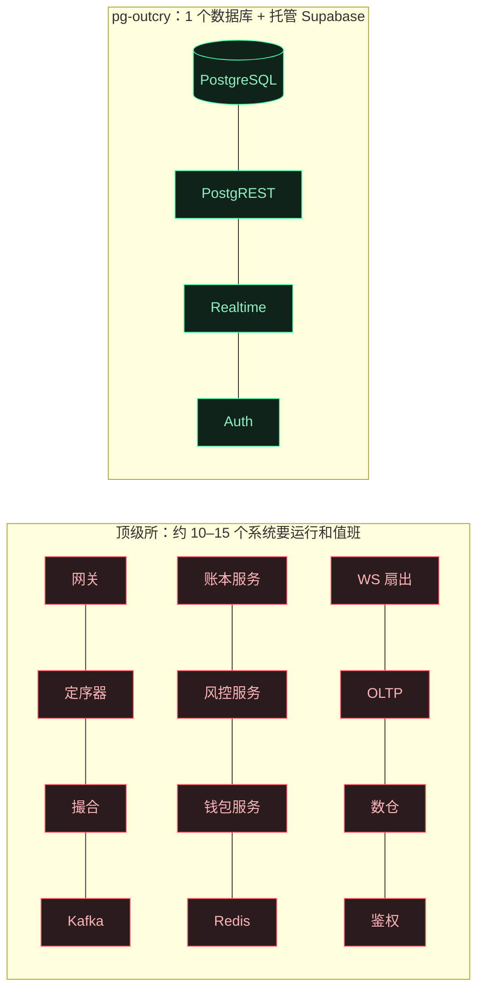
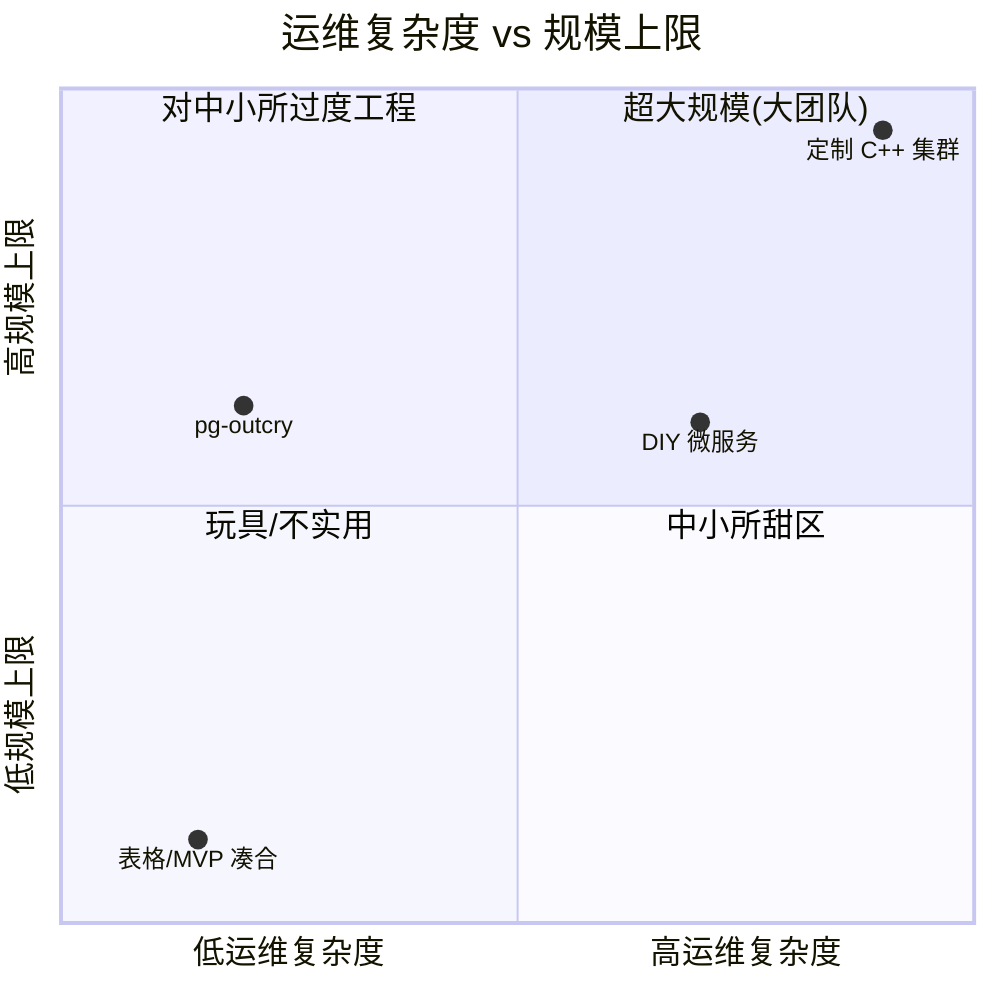

[English](./WHY.md) · **中文**

# 为什么选 pg-outcry

**架构剖析 · 与顶级交易所技术栈对比 · 中小交易所的巨大优势。**

[← 返回 README](./README.zh-CN.md)

---

## 1. 两种架构对照

顶级交易所（币安 / Coinbase / Kraken 级别）是**一支由消息总线串起来的专用服务集群**，为微秒级延迟和每秒百万级订单而生。

```mermaid
flowchart TB
  subgraph TopTier["顶级交易所 —— 分布式服务集群"]
    direction TB
    GW["FIX / REST / WS 网关"] --> SEQ["定序器 Sequencer"]
    SEQ --> ME["内存撮合引擎<br/>(C++, 按品种, Disruptor)"]
    ME --> BUS{{"消息总线<br/>Kafka / Aeron"}}
    BUS --> MD["行情发布器"] --> WSF["WS 扇出网关"]
    BUS --> LED["结算 / 账本服务"]
    BUS --> RSK["风控引擎"]
    BUS --> WAL["钱包 / 资金服务"]
    LED --> ODB[("OLTP 数据库")]
    WAL --> ODB
    RSK --> CACHE[("Redis 缓存")]
    LED --> DWH[("数仓")]
    ME -.日志.-> JRNL[("Journal + 快照<br/>用于崩溃重放")]
  end
  style ME fill:#1c2b22,stroke:#4ef7a8
  style BUS fill:#2a1c1c,stroke:#ff5d6c
```

pg-outcry 把这支集群收敛成**一个数据库 + Supabase 托管服务**。撮合、账本、风控都是 PL/pgSQL 函数；持久化、ACID、崩溃恢复交给数据库本身。

```mermaid
flowchart TB
  subgraph PG["pg-outcry —— 一个数据库就是交易所"]
    direction TB
    PR["PostgREST<br/>(RPC + 视图)"] --> FN
    RT["Realtime<br/>(广播 + RLS 私有流)"] --- WALX[("WAL")]
    AU["Auth / GoTrue"] --- DB
    subgraph DB["PostgreSQL"]
      FN["process_trade_order()<br/>撮合 + 结算 在同一个 ACID 事务"] --> LEDG["双边记账账本<br/>(只追加)"]
      FN --> RISK["风控校验"]
      FN --> BOOK["price_level / book_order<br/>(UNLOGGED, 内存)"]
      LEDG --> WALX
    end
  end
  CL["浏览器 —— WASM 终端 + 后台"] -->|/rpc| PR
  CL -->|md:&lt;symbol&gt; · 私有流| RT
  CL -->|OAuth2| AU
  style FN fill:#1c2b22,stroke:#4ef7a8
```

---

## 2. 一笔订单的生命周期

把一笔订单追下来，差别最刺眼。顶级交易所要穿过许多服务，**正确性成了分布式问题**（先在内存里撮合，账本再通过事件追上）。

在 pg-outcry 里，整个撮合**和**双边记账结算发生在**同一个数据库事务**里。RPC 一返回，成交与资金已经**原子地**一起完成 —— 要么都成，要么都不成。

---

## 3. 一致性模型

> 在大规模场景，最终一致的「窗口」是为吞吐换来的*特性*；对中小交易所它多半是*负担* —— 「成交了但余额不对」的工单和审计问题就出在这里。pg-outcry 直接消灭了这个窗口。

---

## 4. 为什么不用他们的技术栈？

顶级技术栈的每个组件都在解决**规模**问题。在中小规模，它们带来的多半是**成本与故障面**。

| 他们的组件 | 大规模为何需要 | 对中小所为何是负担 | 我们的做法 |
|---|---|---|---|
| **内存 C++ 引擎** | µs 延迟、每秒百万级 | 需要自研日志、快照、重放、故障切换 —— 数月工作量 | PL/pgSQL 撮合；数据库自带 ACID + 持久化 + 恢复 |
| **Kafka / Aeron 总线** | 服务解耦、流重放 | 又一套要运维的分布式系统；**引入最终一致** | 单事务；Realtime 直接读 WAL |
| **Redis 缓存** | 余额/盘口在库外 | 缓存失效 bug；又一套 HA 系统 | 热数据是同库内的 `shared_buffers` + UNLOGGED 表 |
| **账本/风控/钱包微服务** | 独立扩展 | N 套部署、N 班值守、分布式事务/saga | 同一 schema 内的函数、同一事务 |
| **自研鉴权层** | 多租户隔离 | 一整套要建设与加固的服务 | Postgres **RLS** —— 零自研鉴权代码 |
| **WS 扇出集群** | 百万级订阅者 | 要运维的基础设施与扩展 | 托管的 Supabase Realtime，RLS 限定 |

**顶级栈换来的吞吐是真的 —— 但当你每秒几千（而非百万）笔订单时，它毫无意义。** 你等于在用超大规模的全部运维代价，去服务很小的一部分流量。

---

## 5. 组件数与故障面

组件越少 → 故障模式越少 → 值班的人越少 → 成本越低。**你不运行的每一个盒子，都不会在凌晨三点把你叫醒。**

---

## 6. 运营成本与团队

定制集群在右上角（大规模、大运维）。pg-outcry 落在**中小所甜区**：低运维复杂度，同时其规模上限足以从容覆盖中小交易所 —— 并且有明确的提升上限的路径（见 §8）。

---

## 7. 中小交易所优势详解

### 7.1 运维与成本
一个 PostgreSQL + Supabase。没有消息队列、缓存、服务网格。一个托管 Supabase 项目或一台 VM 即可；**一两个工程师**运营整个交易所。你为一套系统付费，而不是一支集群。

### 7.2 上线速度
`supabase db reset` 装上 schema，打开内置终端与后台 —— 你拿到的是一个**能跑的交易所**，不是一个集成项目。按天，而非按季度。

### 7.3 不用自己造的正确性
双边记账、资金冻结、幂等充提、单事务结算、只追加账本、用户级 RLS —— 这些能拖垮小团队的金融正确性工作，已做好并测试。

### 7.4 合规与信任脚手架

```mermaid
flowchart LR
  TX["每笔成交 / 转账"] --> L["只追加<br/>双边记账账本"]
  L --> R["reconcile()<br/>5 条不变量"]
  ADM["管理操作"] --> AUD["审计日志"]
  L --> RPT["余额始终<br/>可重新推导"]
  R --> OK{{"0 失败 = 账平"}}
  style OK fill:#10231a,stroke:#4ef7a8
```

只追加账本 + 持续对账 + 管理审计 + 账户冻结 + 按品种风控 = 审计方与银行合作方会问到的控制项，开箱即有。

### 7.5 没有团队也有实时与体验
公共行情（合并 L2 + 成交带）走广播；每个用户的私有订单/成交/钱包流走 RLS 限定的 Postgres Changes —— **无中继服务、无按用户布线**。内置 WASM 终端已在前端渲染蜡烛 + 全套指标 + 画线工具。

### 7.6 可审计、无锁定
撮合与结算是你能读、能 fork、能审计的纯 SQL。没有黑盒引擎二进制、没有私有协议。

---

## 8. 「会不会很快撑不住？」—— 扩展路径

你**沿单一维度逐步扩展**，无需重写：

按 symbol 的并发已经具备（advisory lock）：不同品种互不阻塞。由于 **CEX 不存在跨 symbol 事务**，按 symbol 跨节点分片很干净、**零 schema 改动** —— 每个分片是同一套迁移、各自拥有互不相交的品种集合，前置无状态路由，共享身份/钱包平面。

---

## 9. 什么情况下别用它

诚实建立信任。如果你需要 **亚 100µs 撮合**、**单品种每秒百万级订单**、或**主机托管 HFT** 市场结构，请上定制内存引擎 —— 顶级技术栈正是*为此而生*。

pg-outcry 面向**绝大多数并非如此的场景**：区域所与零售所、山寨币/现货所、券商撮合、预测/模拟市场，以及需要「正确、合规、低成本」先上线、再有节奏地扩展的新交易所。

**交易所级的正确性、实时性与合规 —— 用小团队真正扛得住的复杂度和成本。**

[← 返回 README](./README.zh-CN.md)

