**English** · [中文](./CHAIN.zh-CN.md)

# On-chain deposits in pure Postgres (testnet)

Watching a blockchain for deposits and crediting them does **not** need an external gateway service —
`pg_cron` + `pg_net`/`http` can do it inside the database. Withdrawals are the exception (signing needs
secp256k1/keccak, which `pgcrypto` lacks). [← docs](./README.md) · [← Comparison](./COMPARISON.md)

```mermaid
flowchart LR
  CRON["pg_cron (every 20s)"] --> POLL["poll_evm / poll_tron / poll_solana<br/>(HTTP to RPC/explorer)"]
  POLL --> CRED["credit_chain_deposit()<br/>idempotent by (chain,txid)"]
  CRED -->|"≥ N confirmations"| LEDGER["process_transfer DEPOSIT from MASTER<br/>→ user balance"]
  SIGN["withdrawal signing<br/>(secp256k1/keccak)"]:::ext -.->|external signer / extension| BROADCAST["broadcast via pg_net"]
  classDef ext fill:#2a1c1c,stroke:#ff5d6c;
```



## What's in the box

- **Core (migration `9920`, fully tested, in CI):** `chain`, `chain_asset`, `watched_address`,
  `chain_cursor`, `chain_deposit` tables; `register_deposit_address()` (user); and
  `credit_chain_deposit()` — **idempotent by `(chain, txid, log_index)`**, credits only past **N
  confirmations**, and books the deposit as a `DEPOSIT` transfer from MASTER with chain evidence.
  Wallet deposit requests cannot mint balances; custody reconciliation reports any customer funding
  that lacks a credited `chain_deposit` or watcher proof. RLS-scoped `my_deposit_addresses` /
  `my_chain_deposits` views.
- **Pollers (opt-in `supabase/chain/pollers.sql`, needs a live RPC + network — not in CI/hosted):**
  `poll_evm` (Sepolia, ERC-20 `eth_getLogs`), `poll_tron` (Nile, TronGrid TRC-20 REST), `poll_solana`
  (testnet, `getSignaturesForAddress` + `getTransaction`), a `poll_all_chains()` dispatcher, and a
  `pg_cron` job every 20s.

## Enable it (self-host, testnet)

```sql
\i supabase/chain/pollers.sql   -- creates the http extension, pollers, and the cron job

-- point each chain at a public testnet RPC and turn it on
update chain set rpc_url='https://ethereum-sepolia-rpc.publicnode.com', enabled=true where name='ethereum-sepolia';
update chain set rpc_url='https://nile.trongrid.io',                    enabled=true where name='tron-nile';
update chain set rpc_url='https://api.testnet.solana.com',              enabled=true where name='solana-testnet';

-- map an on-chain asset → an exchange currency (demo maps testnet assets to EUR)
insert into chain_asset(chain,token,currency,decimals) values
  ('ethereum-sepolia', lower('0x<test-erc20-contract>'), 'EUR', 6),
  ('tron-nile',        'native', 'EUR', 6),
  ('solana-testnet',   'native', 'EUR', 9);
```

A user then registers the address they'll deposit to (or an operator inserts HD-derived addresses):

```
select register_deposit_address('ethereum-sepolia', '0xYourSepoliaAddress');
```

Get testnet funds from faucets (Sepolia ETH/ERC-20, Tron Nile TRX, Solana testnet SOL), send to the
registered address, and within a couple of poll cycles the balance appears — credited entirely in-DB.

## Test it against a local node

`scripts/test-chain-local.sh` runs the whole loop against a **local anvil** node (Foundry): it
deploys a minimal ERC-20, sends a `Transfer` to a watched address, then calls `poll_evm()` inside
Postgres and asserts the deposit is credited (EUR = 2.5). Requires `supabase start` + foundry + docker:

```bash
./scripts/test-chain-local.sh      # spins up anvil, deploys, transfers, polls, asserts credit
```

The EVM log decoder (`hex_to_numeric` + topic/data parsing) is also checked deterministically against
a real Transfer-log shape — including 256-bit amounts that overflow a naive `int64` parse.

## Confirmations & idempotency

`chain.confirmations` defaults: Sepolia 12, Tron Nile 19, Solana 32. `credit_chain_deposit` records
every sighting (updating the confirmation count) but only books the ledger transfer once, the first
time it sees `confirmations ≥ N`. Re-seeing the same `(chain, txid, log_index)` returns `duplicate`
and never double-credits — verified in `scripts/smoke-features.mjs`.

## Withdrawals — DB-owned queue + external signer

To **send** a withdrawal you must build and **sign** a transaction with the hot key. `pgcrypto` has no
secp256k1/keccak, so signing can't be done in stock SQL — but the **database still owns the queue and
decides what to send**; the signer is a thin external worker whose only job is to sign + broadcast
(its private key never touches the DB).

The send-queue (migration `9925`, service_role-only) sits on top of the approved-withdrawal flow:

```
request_withdrawal_to → APPROVED (admin) → next_withdrawal_to_sign() → signer signs+broadcasts
                                          → mark_withdrawal_broadcast(txid) → mark_withdrawal_confirmed()
```

- `next_withdrawal_to_sign()` atomically **claims** the next approved withdrawal that has a
  `to_address` (`FOR UPDATE SKIP LOCKED` + stamps `signing_claimed_at`), so concurrent signers never
  double-send — each withdrawal is handed out at most once.
- `mark_withdrawal_broadcast(pub, txid)` / `mark_withdrawal_confirmed(pub)` are idempotent. Funds were
  already debited at approval, so the queue touches no ledger rows — only send bookkeeping.
- **[`examples/withdrawal-signer.mjs`](../examples/withdrawal-signer.mjs)** is an example EVM signer
  (ethers v6): loop `next_withdrawal_to_sign` → sign with `HOT_KEY` → broadcast via `RPC_URL` →
  `mark_withdrawal_broadcast`. Run it next to the DB; the key lives only in its env.

Alternatively, a **signing extension** (C / `plpython3u` / `plv8`) keeps signing in-DB — but that puts
hot keys in the database, a real security tradeoff. HD **address derivation** (per-user deposit
addresses) similarly needs secp256k1/bip32 — an extension, or pre-generate addresses externally and
load them into `watched_address`.

> Net: **deposits are pure-Postgres; only withdrawal signing + address derivation are external.** That
> already puts the database in charge of more of the wallet than peatio/OpenCEX/OPEX, which run a
> separate blockchain-gateway service for both directions.
