[English](./CHAIN.md) · **中文**

# 纯 Postgres 链上充值（测试网）

监听区块链充值并入账**不需要**外部网关服务 —— `pg_cron` + `pg_net`/`http` 能在数据库内完成。提现是例外
（签名需要 secp256k1/keccak，`pgcrypto` 没有）。[← 文档](./README.md) · [← 横向对比](./COMPARISON.zh-CN.md)

```mermaid
flowchart LR
  CRON["pg_cron（每 20 秒）"] --> POLL["poll_evm / poll_tron / poll_solana<br/>（HTTP 调 RPC/浏览器）"]
  POLL --> CRED["credit_chain_deposit()<br/>按 (chain,txid) 幂等"]
  CRED -->|"≥ N 个确认"| LEDGER["process_transfer 从 MASTER 入金<br/>→ 用户余额"]
  SIGN["提现签名<br/>(secp256k1/keccak)"]:::ext -.->|外部签名器 / 扩展| BROADCAST["经 pg_net 广播"]
  classDef ext fill:#2a1c1c,stroke:#ff5d6c;
```



## 内含什么

- **核心（迁移 `9920`，完全测试、进 CI）：** `chain`、`chain_asset`、`watched_address`、`chain_cursor`、
  `chain_deposit` 表；`register_deposit_address()`（用户）；以及 `credit_chain_deposit()` ——
  **按 `(chain, txid, log_index)` 幂等**，仅在达到 **N 个确认**后入账，并以从 MASTER 的 `DEPOSIT` 转账记账
  （与人工审批同一路径，因此对账不变量成立）。RLS 限定的 `my_deposit_addresses` / `my_chain_deposits` 视图。
- **轮询器（可选 `supabase/chain/pollers.sql`，需要真实 RPC + 网络 —— 不进 CI/托管）：**
  `poll_evm`（Sepolia，ERC-20 `eth_getLogs`）、`poll_tron`（Nile，TronGrid TRC-20 REST）、
  `poll_solana`（testnet，`getSignaturesForAddress` + `getTransaction`）、调度函数 `poll_all_chains()`，
  以及每 20 秒的 `pg_cron` 任务。

## 启用（自建、测试网）

```sql
\i supabase/chain/pollers.sql   -- 创建 http 扩展、轮询器与 cron 任务

-- 给每条链指向公共测试网 RPC 并开启
update chain set rpc_url='https://ethereum-sepolia-rpc.publicnode.com', enabled=true where name='ethereum-sepolia';
update chain set rpc_url='https://nile.trongrid.io',                    enabled=true where name='tron-nile';
update chain set rpc_url='https://api.testnet.solana.com',              enabled=true where name='solana-testnet';

-- 把链上资产映射到交易所币种（演示把测试网资产映射到 EUR）
insert into chain_asset(chain,token,currency,decimals) values
  ('ethereum-sepolia', lower('0x<测试 ERC20 合约>'), 'EUR', 6),
  ('tron-nile',        'native', 'EUR', 6),
  ('solana-testnet',   'native', 'EUR', 9);
```

用户随后注册其充值地址（或运营方插入 HD 派生地址）：

```
select register_deposit_address('ethereum-sepolia', '0x你的Sepolia地址');
```

从水龙头领测试币（Sepolia ETH/ERC-20、Tron Nile TRX、Solana testnet SOL），打到注册的地址，几个轮询周期内
余额就会出现 —— 完全在库内入账。

## 确认数与幂等

`chain.confirmations` 默认：Sepolia 12、Tron Nile 19、Solana 32。`credit_chain_deposit` 记录每次观察
（更新确认数），但只在首次看到 `confirmations ≥ N` 时入账一次。再次看到相同的 `(chain, txid, log_index)`
返回 `duplicate`，绝不重复入账 —— 已由 `scripts/smoke-features.mjs` 验证。

## 提现 —— 唯一的外部件

要**发出**提现，必须用热私钥构造并**签名**交易。`pgcrypto` 没有 secp256k1/keccak，所以这无法用原生 SQL 完成。
可选：

- 一个签名**扩展**（C / `plpython3u` / `plv8`）—— 留在库内，但热私钥在数据库里（真实的安全权衡）；或
- 一个**极小的外部签名器** —— 数据库拥有提现队列、决定*发什么*；签名器只负责签名；广播签名后的交易是一次
  `pg_net` HTTP 调用。

HD **地址派生**（每用户充值地址）同样需要 secp256k1/bip32 —— 用扩展，或在外部预生成地址再载入 `watched_address`。

> 总之：**充值是纯 Postgres 的；只有提现签名 + 地址派生是外部的。** 这已经让数据库掌管了比
> peatio/OpenCEX/OPEX 更多的钱包逻辑 —— 它们两个方向都跑一个独立的区块链网关服务。
