**English** · [中文](./FEATURES.zh-CN.md)

# On-chain deposits in pure Postgres (testnet)

Watching a blockchain for deposits and crediting them does **not** need an external gateway service —
`pg_cron` + `pg_net`/`http` can do it inside the database. Withdrawals are the exception (signing needs
secp256k1/keccak, which `pgcrypto` lacks). [← docs](./README.md) · [← Comparison](./WHY.md)

```mermaid
flowchart LR
  CRON["pg_cron (every 20s)"] --> POLL["poll_evm / poll_tron / poll_solana<br/>(HTTP to RPC/explorer)"]
  POLL --> CRED["credit_chain_deposit()<br/>idempotent by (chain,txid)"]
  CRED -->|"≥ N confirmations"| LEDGER["process_transfer DEPOSIT from MASTER<br/>→ user balance"]
  SIGN["withdrawal signing<br/>(secp256k1/keccak)"]:::ext -.->|external signer / extension| BROADCAST["broadcast via pg_net"]
  classDef ext fill:#2a1c1c,stroke:#ff5d6c;
```



### What's in the box

- **Core (migration `00710`, fully tested, in CI):** `chain`, `chain_asset`, `watched_address`,
  `chain_cursor`, `chain_deposit` tables; `register_deposit_address()` (user); and
  `credit_chain_deposit()` — **idempotent by `(chain, txid, log_index)`**, credits only past **N
  confirmations**, and books the deposit as a `DEPOSIT` transfer from MASTER with chain evidence.
  Wallet deposit requests cannot mint balances; custody reconciliation reports any customer funding
  that lacks a credited `chain_deposit` or watcher proof. RLS-scoped `my_deposit_addresses` /
  `my_chain_deposits` views.
- **Pollers (opt-in `supabase/chain/pollers.sql`, needs a live RPC + network — not in CI/hosted):**
  `poll_evm` (Sepolia, ERC-20 `eth_getLogs`), `poll_tron` (Nile, TronGrid TRC-20 REST), `poll_solana`
  (testnet, `getSignaturesForAddress` + `getTransaction`), a `poll_all_chains()` dispatcher, and a
  `pg_cron` job every 20s.

### Enable it (self-host, testnet)

```sql
\i supabase/chain/pollers.sql   -- creates the http extension, pollers, and the cron job

-- point each chain at a public testnet RPC and turn it on
update chain set rpc_url='https://ethereum-sepolia-rpc.publicnode.com', enabled=true where name='ethereum-sepolia';
update chain set rpc_url='https://nile.trongrid.io',                    enabled=true where name='tron-nile';
update chain set rpc_url='https://api.testnet.solana.com',              enabled=true where name='solana-testnet';

-- map an on-chain asset → an exchange currency (demo maps testnet assets to EUR)
insert into chain_asset(chain,token,currency,decimals) values
  ('ethereum-sepolia', lower('0x<test-erc20-contract>'), 'EUR', 6),
  ('tron-nile',        'native', 'EUR', 6),
  ('solana-testnet',   'native', 'EUR', 9);
```

A user then registers the address they'll deposit to (or an operator inserts HD-derived addresses):

```
select register_deposit_address('ethereum-sepolia', '0xYourSepoliaAddress');
```

Get testnet funds from faucets (Sepolia ETH/ERC-20, Tron Nile TRX, Solana testnet SOL), send to the
registered address, and within a couple of poll cycles the balance appears — credited entirely in-DB.

### Test it against a local node

`scripts/test-chain-local.sh` runs the whole loop against a **local anvil** node (Foundry): it
deploys a minimal ERC-20, sends a `Transfer` to a watched address, then calls `poll_evm()` inside
Postgres and asserts the deposit is credited (EUR = 2.5). Requires `supabase start` + foundry + docker:

```bash
./scripts/test-chain-local.sh      # spins up anvil, deploys, transfers, polls, asserts credit
```

The EVM log decoder (`hex_to_numeric` + topic/data parsing) is also checked deterministically against
a real Transfer-log shape — including 256-bit amounts that overflow a naive `int64` parse.

### Bitcoin testnet4 (migration `00160`)

Users pick **BTC → Bitcoin · testnet4** under Wallet → Deposit and get a native segwit
`tb1q…` address, derived in-DB from the HD master seed (secp256k1 → compressed pubkey →
`hash160` → bech32; checked against the BIP-173 vectors). `poll_bitcoin` reads an Esplora API
(`https://mempool.space/testnet4/api` by default) and credits every output paying a watched
address through `credit_chain_deposit`, keyed `(txid, vout)`, after 2 confirmations. The chain
ships disabled; turn it on with:

```sql
select admin_set_chain_config('bitcoin-testnet4', enabled_param => true);
```

Deposits only: there is no BTC withdrawal signer yet.

### Confirmations & idempotency

`chain.confirmations` defaults: Sepolia 12, Tron Nile 19, Solana 32. `credit_chain_deposit` records
every sighting (updating the confirmation count) but only books the ledger transfer once, the first
time it sees `confirmations ≥ N`. Re-seeing the same `(chain, txid, log_index)` returns `duplicate`
and never double-credits — verified in `scripts/smoke-features.mjs`.

### Withdrawals — DB-owned queue + external signer

To **send** a withdrawal you must build and **sign** a transaction with the hot key. `pgcrypto` has no
secp256k1/keccak, so signing can't be done in stock SQL — but the **database still owns the queue and
decides what to send**; the signer is a thin external worker whose only job is to sign + broadcast
(its private key never touches the DB).

The send-queue (migration `00720`, service_role-only) sits on top of the approved-withdrawal flow:

```
request_withdrawal_to → APPROVED (admin) → next_withdrawal_to_sign() → signer signs+broadcasts
                                          → mark_withdrawal_broadcast(txid) → mark_withdrawal_confirmed()
```

- `next_withdrawal_to_sign()` atomically **claims** the next approved withdrawal that has a
  `to_address` (`FOR UPDATE SKIP LOCKED` + stamps `signing_claimed_at`), so concurrent signers never
  double-send — each withdrawal is handed out at most once.
- `mark_withdrawal_broadcast(pub, txid)` / `mark_withdrawal_confirmed(pub)` are idempotent. Funds were
  already debited at approval, so the queue touches no ledger rows — only send bookkeeping.
- **[`examples/withdrawal-signer.mjs`](../examples/withdrawal-signer.mjs)** is an example EVM signer
  (ethers v6): loop `next_withdrawal_to_sign` → sign with `HOT_KEY` → broadcast via `RPC_URL` →
  `mark_withdrawal_broadcast`. Run it next to the DB; the key lives only in its env.

Alternatively, a **signing extension** (C / `plpython3u` / `plv8`) keeps signing in-DB — but that puts
hot keys in the database, a real security tradeoff. HD **address derivation** (per-user deposit
addresses) similarly needs secp256k1/bip32 — an extension, or pre-generate addresses externally and
load them into `watched_address`.

> Net: **deposits are pure-Postgres; only withdrawal signing + address derivation are external.** That
> already puts the database in charge of more of the wallet than peatio/OpenCEX/OPEX, which run a
> separate blockchain-gateway service for both directions.

---

## Derivatives & staking in pure Postgres — feasibility + plan

Can margin / futures / staking be done in pure PG, and what extensions help?

> **First, the honest finding:** none of [peatio](https://github.com/openware/peatio),
> [OpenCEX](https://github.com/Polygant/OpenCEX), or [OPEX](https://github.com/opexdev/core) implement
> these in **open source** — they're spot exchanges. peatio's margin/perps/P2P live only in Openware's
> *commercial* OpenDAX; OpenCEX/OPEX don't ship them. So there's no OSS reference to copy — the design
> below is the standard exchange architecture mapped onto pure PG.

### Verdict

All three are achievable in pure PostgreSQL with **only `pg_cron` + `pg_net`** (already in use) — **no
new bespoke extension required**. Effort: **staking (small) < spot margin (moderate) < perpetual
futures (large)**. The only inherently-external dependency is a **price oracle** (index/mark for
liquidation & funding), fetched the same way as on-chain deposits. The real cost is the **risk
surface** (liquidations, funding, insurance fund), not the database.

### Extension map (grounded in the Supabase image)

| Extension | Helps with | Status here |
|---|---|---|
| **pg_cron** | accrual / funding / liquidation / unbonding timers | ✅ installed |
| **pg_net** / **http** | external index/oracle price feeds | ✅ installed |
| **pgmq** | durable queues: unbonding, liquidation, funding, withdrawals (vs hand-rolled `SKIP LOCKED`) | ✅ available — **now used for staking unbonding** |
| **pg_partman** | auto-partition time-series (funding payments, mark-price history) | ✅ available |
| **pgsodium** | ed25519 signing in-DB → **Solana/Sui** withdrawals/stake txs natively | ✅ available |
| **supabase_vault** | encrypt the hot signer key at rest if signing in-DB | ✅ installed |
| **wrappers** (FDW) | model an external price API / exchange as a foreign table (oracle) | ✅ available |
| **plpgsql_check** · **pgtap** | static-check + unit-test the large risk engine | ✅ available |
| **pgaudit** | compliance-grade audit logging for the regulated surface | ✅ available |
| _TimescaleDB / toolkit_ | hypertables + continuous aggregates → server-side OHLCV, mark/funding series | ❌ **not in the image** (self-host only) |
| _plv8 / plpython3u_ | in-DB JS/Python (e.g. a secp256k1 lib) | ❌ not available |

**Signing nuance:** **ed25519 chains (Solana, Sui)** can be signed *in-DB* with `pgsodium` (+ key in
`supabase_vault`). **secp256k1 chains (BTC, all EVM, Tron)** have no stock extension → external signer
(current design) or a **custom C extension** compiling `libsecp256k1` (same pattern as `oc_fastmath`).

### 1. Staking — ✅ shipped (migration `9930`)

Stake a currency, earn rewards (APR) via a reward-per-token accumulator (MasterChef pattern, settled
lazily on each interaction — no accrual cron), unstake with an unbonding period.

- Money movement reuses `process_transfer`, so reconciliation holds: **stake** = `WITHDRAWAL` user→MASTER
  (locks principal), **reward** = `DEPOSIT` MASTER→user (issuance, like a faucet), **unbond** =
  `DEPOSIT` MASTER→user after the delay.
- **pgmq** holds the unbonding queue (`pgmq.send(..., delay)`); a **pg_cron** job `process_unbonding()`
  drains matured messages and returns principal.
- RPCs: `stake` / `unstake` / `claim_stake_rewards` (authenticated); views `my_stakes` (live pending
  reward) + `stake_pools`. Verified in `scripts/smoke-features.mjs` (stake → ~10 reward at 10% APR →
  unstake → unbond release → **reconcile() all PASS**).

### 2. Spot margin — ✅ shipped (migration `9940`)

Cross-margin, valued in the EUR quote via last trade prices. `borrow` against collateral (the house
lends from MASTER) with a **max-leverage cap** (total debt ≤ equity·(L−1)); interest accrues lazily;
`repay`; and a `pg_cron` **liquidation monitor** (`check_margin_liquidations`) that marks each account
to the current price and **liquidates** when equity ≤ debt·maintenance_ratio. All money moves via
`process_transfer` (borrow = DEPOSIT MASTER→user, repay/liquidation = user→MASTER), so reconciliation
holds. RPCs `borrow` / `repay` / `my_margin_health` (authenticated); views `my_margin` + `margin_terms`.
Verified in `scripts/smoke-features.mjs` (borrow 2x → over-leverage rejected → repay → interest-driven
liquidation seizes collateral → **reconcile() all PASS**).

**Simplified vs production:** liquidation is a forced settlement at the mark (seize collateral, clear
debt, shortfall borne by the house) rather than routing a market order through the book; no partial
liquidation / insurance fund / ADL. No new extension needed.

### 3. Perpetual futures — ✅ shipped (migration `9950`)

Position-based linear perp (`BTC-PERP`, EUR-margined):
- **Mark price** set by an oracle (`update_perp_mark`, `pg_cron`) from the spot last trade — or
  overridable / fed externally via `pg_net` for a real index.
- **`open_perp` / `close_perp`** — post margin, take a signed position with a **max-leverage cap**;
  close realizes uPnL = size·(mark−entry); payout = margin+PnL (clamped ≥0), all via `process_transfer`.
- **Funding** (`apply_perp_funding`, `pg_cron`) — longs pay shorts when the rate is positive (adjusts
  the margin claim).
- **Liquidation** (`check_perp_liquidations`, `pg_cron`) — seizes margin when equity ≤
  size·mark·maintenance_ratio.
- Views `my_perp` (live uPnL/equity) + `perp_markets`. Verified in `scripts/smoke-features.mjs`
  (open 5x long → mark→130 uPnL 30 → close +30 → liquidation on a drop → funding charge →
  **reconcile() all PASS**).

**Simplified vs production:** one netted position per market, open-from-flat only; the house (MASTER)
is the counterparty/insurance (PnL not netted long-vs-short); liquidation seizes margin at the mark
(no partial close / book routing / ADL). `pg_partman` for funding/mark-price history at scale.

### Roadmap

`staking ✅ → spot margin ✅ → perpetual futures ✅`. Each is opt-in and carries real financial risk — these
sit at the regulated end ([WHY.md §9](./WHY.md#9-when-not-to-use-this)); pg-outcry's core remains a
correctness-first **spot** exchange.

---

[← Back to docs](./README.md) · [← Project README](../README.md)
