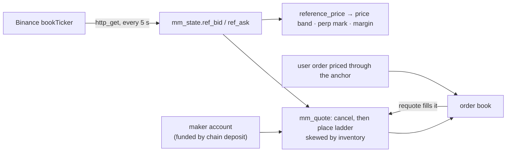

**English** · [中文](./OPERATIONS.zh-CN.md)

# Operations runbook

What an operator needs when something is wrong at 3am. Everything here is
exercised against the demo deployment, not aspirational.

[← Back to docs](./README.md) · [← Project README](../README.md)

## Daily / automated

| Job | Where | Cadence |
|---|---|---|
| `run_reconcile_monitor()` — records invariant breaks into `reconcile_alert` **and pages** | `pg_cron` | 5 min |
| `refresh_candle_1m()` — incremental OHLCV cache | `pg_cron` | 1 min |
| Chain pollers (`poll_native_balances`, memo/token pollers) | `pg_cron` | 30 s |
| Withdrawal signing + confirmations | `pg_cron` | per chain |
| `roll-partitions` — create next month's trade/ledger partitions | `pg_cron` | daily |
| `scripts/check-drift.sh` — deployed DB vs this repo | CI / manual | per deploy |
| `mm_tick()` — Binance-anchored market maker (only while a pair is enabled) | `pg_cron` | 5 s |

### Wire up paging (do this before you take real deposits)

```sql
select ops_set_alert_webhook('https://hooks.slack.com/services/…');
```

Any endpoint accepting a JSON POST works (Slack, Discord, PagerDuty events API).
Alerts are rate-limited per check (`ops_alert_config.min_seconds`, default 15 min)
so one persistent break doesn't spam. With no URL configured the monitor still
records to `reconcile_alert` but never calls out.

Verify the plumbing without breaking anything:
```sql
insert into reconcile_alert(check_name, failures) values ('test_page', 1);
select ops_notify_alerts();          -- expect 1, and a message in your channel
delete from reconcile_alert where check_name = 'test_page';
```

## Market maker (Binance-anchored)

`mm_tick()` keeps a ladder of quotes centred on the Binance book
(`data-api.binance.vision` bookTicker, fetched in-DB with the `http` extension).
It trades from an **ordinary customer account** that you fund with real deposits;
nothing moves money out of MASTER, so the maker cannot create balances, and
`custody_funding_exposure` checks it like any other customer. The anchor price is
also what the price band, perp index and margin valuation use.



Setup:

1. Sign up a **dedicated** account in the trading terminal (e.g. `mm@yourdomain`).
   Don't trade from it by hand: every tick cancels all of its open orders on the pair.
2. Logged in as that account, **Wallet → Deposit**: send USDT and BTC on-chain to its
   deposit address. The balance appears once the chain poller confirms it.
3. Back-office **Markets → Market Maker**: assign the account by email, adjust the
   settings, **Enable**. Or as service_role:

```sql
select admin_mm_set_account('BTC_USDT', 'mm@yourdomain');
select admin_mm_configure('BTC_USDT', '{"target_base": 2, "max_skew_base": 1,
                          "half_spread_bps": 5, "levels": 5, "level_size": 0.01}');
select admin_mm_set_enabled('BTC_USDT', true);           -- arms the 5 s pg_cron job
select admin_mm_status();
```

To take money out: **Disable** (that cancels the quotes and frees the reserved
balance), then withdraw through the normal wallet flow as that account. The account
can only be changed while the maker is disabled.

| Setting | Meaning |
|---|---|
| `half_spread_bps`, `level_step_bps`, `levels` | best quote distance from the Binance mid, gap between levels, levels per side |
| `level_size`, `size_growth` | first-level size in base, growth per level (0.5 = +50%) |
| `target_base`, `max_skew_base`, `skew_bps` | inventory the maker aims to hold; at `max_skew_base` away from it the side that would grow the position stops and quotes are shifted by `skew_bps` |
| `max_ref_age_s`, `max_ref_move_pct` | pull all quotes when Binance data is older than this, or jumps more than this between fetches |

`status` is `quoting`, `paused` (with a `reason`: `no_maker_account`,
`reference_stale`, `reference_jump`, `fetch_failed`, `quote_failed`, `no_balance`)
or `disabled`. The inventory is not hedged on Binance: deposit what you accept
losing if the price runs one way.

## Drift: the deployed DB vs this repo

**Migration bookkeeping is not proof.** Anything applied by hand leaves no trace
in `schema_migrations`. Two live backdoors were found exactly this way — a
`demo_faucet()` that minted balances to any signed-in user, and a legacy 2-arg
`request_deposit()` that bypassed the chain-backed funding check. Both existed on
a database whose migration records looked perfectly clean.

```bash
scripts/check-drift.sh "postgresql://…"     # compares against a fresh local reset
```

It reports objects the target has that the repo doesn't (audit these — they may be
live backdoors) and objects the repo defines that the target lacks (migrations not
fully applied). Time-rolled partitions are filtered out; intentional extras go in
`scripts/drift-allow.txt` with a comment explaining why.

## Backup & restore

### What must be backed up

| | Covered by PITR / `pg_dump` | Notes |
|---|---|---|
| Ledger, orders, balances, chain deposits | ✅ | the system of record |
| **Vault secrets (the master seed)** | ⚠️ **separately** | losing it means losing every derived deposit address — see below |
| `book_order` / `price_level` (UNLOGGED) | ❌ | not in PITR or replicas by design; rebuild after restore |
| `pg_cron` jobs | ✅ (in `cron` schema) | verify after restore |

Hosted Supabase gives you PITR on paid plans; enable it. Self-host: standard
`pg_basebackup` + WAL archiving.

### The master seed is the one irreplaceable secret

Deposit addresses are derived from it. Restore the database without it and every
customer's deposit address becomes unspendable. Back it up **out of band**, before
taking any deposit:

```sql
select decrypted_secret from vault.decrypted_secrets where name = 'wallet_master_seed';
```

Store it the way you'd store a wallet seed phrase — offline, split, tested.
(This is also the reason the hosted demo is testnet-only: a seed inside the
database means compromising the database compromises the funds.)

### Restore procedure

1. Restore the database (PITR to a timestamp, or `pg_restore`).
2. Re-create the vault secret if the restore didn't carry it.
3. Rebuild the in-memory book — UNLOGGED tables come back empty:
   ```sql
   select rebuild_book();
   ```
4. Verify the ledger before reopening:
   ```sql
   select * from reconcile();     -- every row must be PASS
   ```
5. Check `pg_cron` jobs are scheduled (`select jobname from cron.job;`).
6. Run `scripts/check-drift.sh` against the restored DB.
7. Only then re-enable trading.

### Failover (hosted, single primary)

`book_order` / `price_level` are UNLOGGED for write throughput, so they are not
replicated. After any failover or unclean shutdown, `select rebuild_book();`
reconstructs the live book from open orders in `trade_order`. Do this **before**
accepting new orders, or the book will be missing resting liquidity.

## Incident: reconciliation is FAILING

`reconcile()` returning anything other than PASS means the ledger disagrees with
itself. Treat it as a stop-trading event.

1. **Stop the bleeding** — suspend the affected accounts
   (`admin_suspend_entity`) rather than the whole venue if it's localised.
2. **Identify the class** from `check_name`:
   - `cash_balance_matches_ledger` / `transfer_double_entry_balanced` — a money
     bug. Do not "fix" balances by hand; find the transfer that broke.
   - `reservations_consistent` — an order/reservation leak; usually a specific
     order id.
   - `approved_wallet_has_transfer` — a wallet approval without its transfer.
   - `issuance_conserved` — total issuance moved; the most serious.
3. **Look for unbacked funding** (customer balances with no chain deposit):
   ```sql
   select * from custody_funding_exposure;
   select * from admin_reverse_unbacked_cash(true, null);   -- dry run first
   ```
4. Every admin action is written to `admin_audit_log` (append-only) — use it for
   the post-mortem, and to prove what was done.

## Upgrading a deployed database

Migrations are squashed layers (see [DEVELOPMENT](./DEVELOPMENT.md)). For an
already-deployed database:

1. `scripts/check-drift.sh` **before** — know what you're starting from.
2. Apply new migrations (`supabase db push`, or `psql -f` for a single file).
3. `scripts/check-drift.sh` **after** — confirm the target now matches the repo.
4. `select * from reconcile();` — confirm the ledger still balances.

Never let the CLI re-apply an already-applied migration: several are destructive
on replay (the ledger/partitioning layer does `drop table if exists trade cascade`).
If you renumber or squash migrations, rewrite the recorded versions in
`supabase_migrations.schema_migrations` instead of re-running anything.
