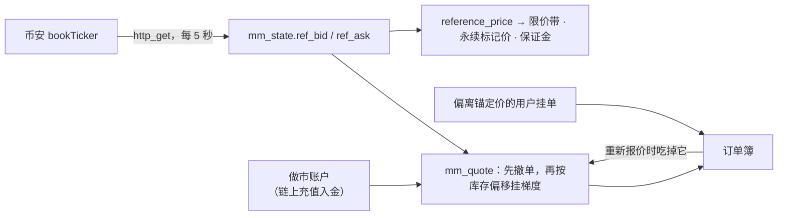

[English](./OPERATIONS.md) · **中文**

# 运维手册

凌晨三点出事时运维需要的东西。这里写的每条命令都在演示环境上实际验证过，不是纸上谈兵。

[← 返回文档](./README.md) · [← 项目 README](../README.zh-CN.md)

## 自动化任务

| 任务 | 位置 | 频率 |
|---|---|---|
| `run_reconcile_monitor()` —— 记录不变量破坏到 `reconcile_alert` **并告警** | `pg_cron` | 5 分钟 |
| `refresh_candle_1m()` —— 增量 OHLCV 缓存 | `pg_cron` | 1 分钟 |
| 链上轮询（`poll_native_balances`、memo/代币轮询） | `pg_cron` | 30 秒 |
| 提现签名与确认 | `pg_cron` | 按链 |
| `roll-partitions` —— 建下个月的成交/账本分区 | `pg_cron` | 每天 |
| `scripts/check-drift.sh` —— 线上库 vs 本仓库 | CI / 手动 | 每次部署 |
| `mm_tick()` —— 锚定币安的做市商（仅在有交易对启用时） | `pg_cron` | 5 秒 |

### 接通告警（收真实充值之前必须做）

```sql
select ops_set_alert_webhook('https://hooks.slack.com/services/…');
```

任何接受 JSON POST 的端点都可以（Slack、Discord、PagerDuty）。告警按 check 限流
（`ops_alert_config.min_seconds`，默认 15 分钟），所以一个持续故障不会刷屏。未配置
URL 时监控仍会记录到 `reconcile_alert`，只是不外发。

不破坏任何东西地验证链路：
```sql
insert into reconcile_alert(check_name, failures) values ('test_page', 1);
select ops_notify_alerts();          -- 期望返回 1，且频道里收到消息
delete from reconcile_alert where check_name = 'test_page';
```

## 做市商（锚定币安）

`mm_tick()` 以币安盘口（`data-api.binance.vision` bookTicker，库内用 `http` 扩展拉取）
为中心挂一组梯度报价。它用一个**普通客户账户**交易，资金由你真实充值；不从 MASTER
转出任何钱，所以做市商不能凭空产生余额，`custody_funding_exposure` 像检查其他客户一样检查它。
锚定价同时作为限价带、永续指数价和保证金估值的参考。



开通步骤：

1. 在交易终端注册一个**专用**账户（如 `mm@yourdomain`）。不要用它手动下单：每一轮都会撤掉它在该交易对上的所有挂单。
2. 登录该账户，**Wallet → Deposit**，把 USDT（TRC-20 · Nile）和 BTC（Bitcoin · testnet4）转到它的充值地址，
   确认数足够后到账（BTC 为 2 个区块）。两条链都需开启（`admin_set_chain_config(<chain>, enabled_param => true)`）。
3. 后台 **Markets → Market Maker**：按邮箱指定该账户、调参数、**Enable**。或以 service_role 执行：

```sql
select admin_mm_set_account('BTC_USDT', 'mm@yourdomain');
select admin_mm_configure('BTC_USDT', '{"target_base": 2, "max_skew_base": 1,
                          "half_spread_bps": 5, "levels": 5, "level_size": 0.01}');
select admin_mm_set_enabled('BTC_USDT', true);           -- 同时挂上 5 秒的 pg_cron 任务
select admin_mm_status();
```

取钱：先 **Disable**（撤单，释放冻结余额），再以该账户走正常提现流程。只有在关闭状态下才能更换做市账户。

| 参数 | 含义 |
|---|---|
| `half_spread_bps`、`level_step_bps`、`levels` | 最优报价离币安中间价的距离、档间距、每边档数 |
| `level_size`、`size_growth` | 第一档数量（基础币）、每档递增比例（0.5 = +50%） |
| `target_base`、`max_skew_base`、`skew_bps` | 目标库存；偏离达到 `max_skew_base` 时停掉会继续加仓的一边，报价整体偏移 `skew_bps` |
| `max_ref_age_s`、`max_ref_move_pct` | 币安数据过期或两次拉取间跳变超过阈值时撤掉全部报价 |

`status` 为 `quoting`、`paused`（附 `reason`：`no_maker_account`、`reference_stale`、
`reference_jump`、`fetch_failed`、`quote_failed`、`no_balance`）或 `disabled`。
库存不在币安对冲：充值金额按"价格单边走时可接受的亏损"来定。

## 漂移：线上库 vs 本仓库

**迁移记录不能作为证据。** 任何手工执行过的东西都不会出现在 `schema_migrations` 里。
两个线上后门正是这样被发现的 —— 一个能给任意登录用户凭空发钱的 `demo_faucet()`，
以及一个绕过链上背书检查的 2 参数 `request_deposit()`。它们所在数据库的迁移记录看起来
完全干净。

```bash
scripts/check-drift.sh "postgresql://…"     # 与一次全新的本地 reset 对比
```

它会报告：目标库有而仓库没有的对象（**要审计，可能是线上后门**），以及仓库定义了但目标库
缺失的对象（迁移没应用全）。按时间滚动的分区已被过滤；有意为之的额外对象写进
`scripts/drift-allow.txt` 并注明原因。

## 备份与恢复

### 必须备份什么

| | PITR / `pg_dump` 是否覆盖 | 说明 |
|---|---|---|
| 账本、订单、余额、链上充值 | ✅ | 系统记录源 |
| **Vault 秘密（主种子）** | ⚠️ **需单独备份** | 丢了就等于丢掉所有派生充值地址，见下 |
| `book_order` / `price_level`（UNLOGGED） | ❌ | 设计上不进 PITR 和副本；恢复后需重建 |
| `pg_cron` 任务 | ✅（在 `cron` schema） | 恢复后需确认 |

托管 Supabase 的付费计划提供 PITR，请启用。自建：标准 `pg_basebackup` + WAL 归档。

### 主种子是唯一不可再生的秘密

充值地址由它派生。恢复了数据库却没有它，每个客户的充值地址都会变成无法动用的地址。
**在收第一笔充值之前**就把它离线备份好：

```sql
select decrypted_secret from vault.decrypted_secrets where name = 'wallet_master_seed';
```

像保管钱包助记词那样保管它 —— 离线、分割、并做过恢复演练。
（这也正是托管演示只跑测试网的原因：种子在数据库里，意味着攻破数据库就等于攻破资金。）

### 恢复流程

1. 恢复数据库（PITR 到某个时间点，或 `pg_restore`）。
2. 如果恢复没带上 vault 秘密，重新写入。
3. 重建内存订单簿 —— UNLOGGED 表恢复后是空的：
   ```sql
   select rebuild_book();
   ```
4. 重新开放交易**之前**先验账：
   ```sql
   select * from reconcile();     -- 每一行都必须是 PASS
   ```
5. 确认 `pg_cron` 任务在册（`select jobname from cron.job;`）。
6. 对恢复后的库跑 `scripts/check-drift.sh`。
7. 以上都通过，才恢复交易。

### 故障切换（托管，单主库）

`book_order` / `price_level` 为了写入吞吐是 UNLOGGED 的，因此不参与复制。任何故障切换或
非正常关机之后，用 `select rebuild_book();` 从 `trade_order` 里的未成交订单重建实时订单簿。
必须在**接受新订单之前**做，否则订单簿会缺失挂单流动性。

## 事故：对账失败

`reconcile()` 返回任何非 PASS 的行，都意味着账本自相矛盾。按「停止交易」级别处理。

1. **先止血** —— 如果影响局部，用 `admin_suspend_entity` 冻结受影响账户，而不是关停整个交易所。
2. **按 `check_name` 判断类别**：
   - `cash_balance_matches_ledger` / `transfer_double_entry_balanced` —— 资金 bug。
     **不要**手工改余额去「对平」，要找出那笔坏掉的转账。
   - `reservations_consistent` —— 订单预留泄漏，通常能定位到具体订单。
   - `approved_wallet_has_transfer` —— 有钱包审批却没有对应转账。
   - `issuance_conserved` —— 发行总量变了，最严重。
3. **排查无背书资金**（没有链上充值支撑的客户余额）：
   ```sql
   select * from custody_funding_exposure;
   select * from admin_reverse_unbacked_cash(true, null);   -- 先 dry run
   ```
4. 所有管理操作都写入只追加的 `admin_audit_log` —— 用它做事后复盘，也用它证明做过什么。

## 升级线上数据库

迁移是分层合并的（见 [DEVELOPMENT](./DEVELOPMENT.zh-CN.md)）。对已部署的数据库：

1. 升级**前**跑 `scripts/check-drift.sh` —— 先搞清起点状态。
2. 应用新迁移（`supabase db push`，或对单个文件用 `psql -f`）。
3. 升级**后**再跑 `scripts/check-drift.sh` —— 确认目标库已与仓库一致。
4. `select * from reconcile();` —— 确认账本仍然平衡。

**绝不要**让 CLI 重放已应用过的迁移：其中若干在重放时是破坏性的（账本/分区那层有
`drop table if exists trade cascade`）。如果你重新编号或合并了迁移，应改写
`supabase_migrations.schema_migrations` 里记录的版本号，而不是重跑任何东西。
