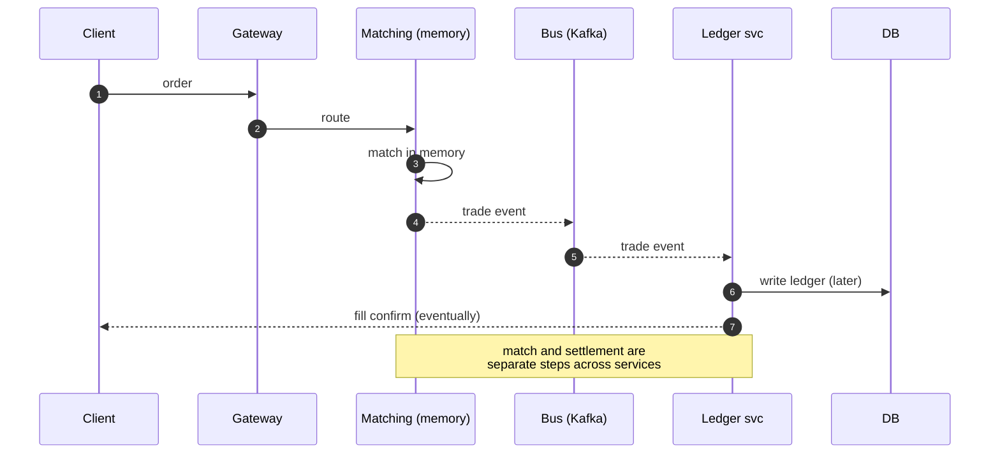
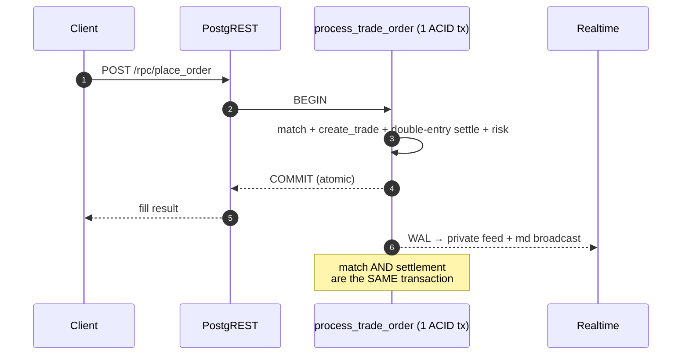
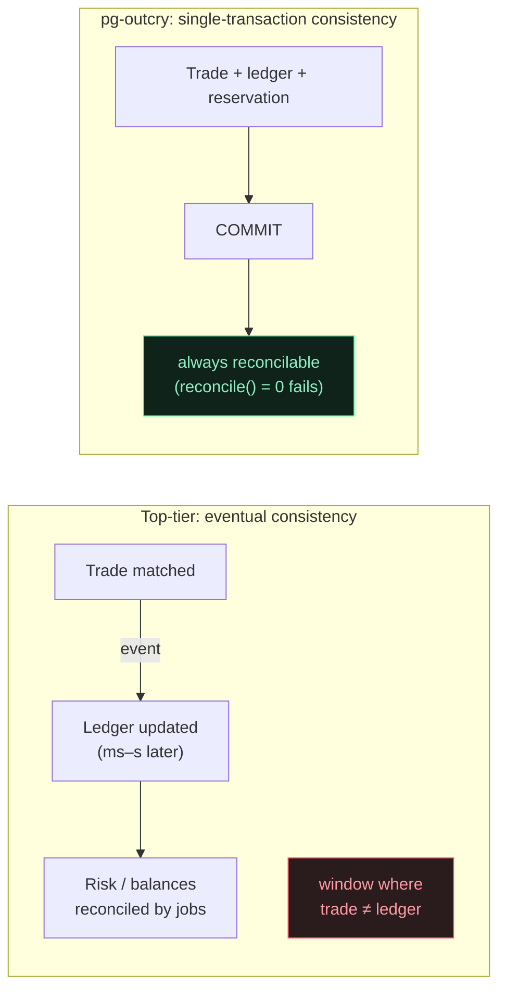
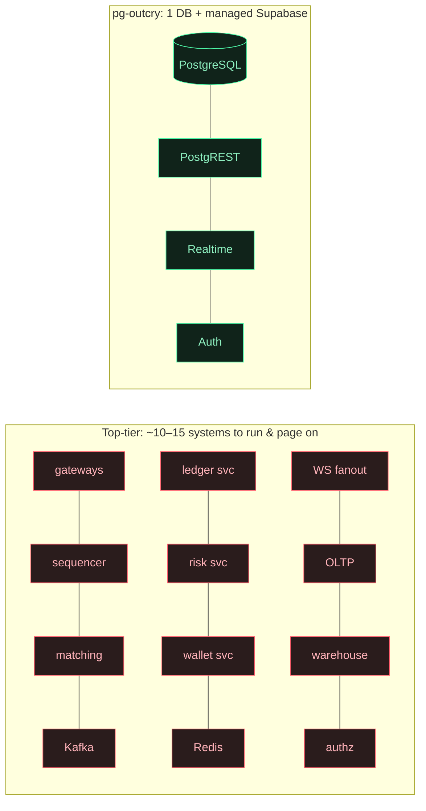
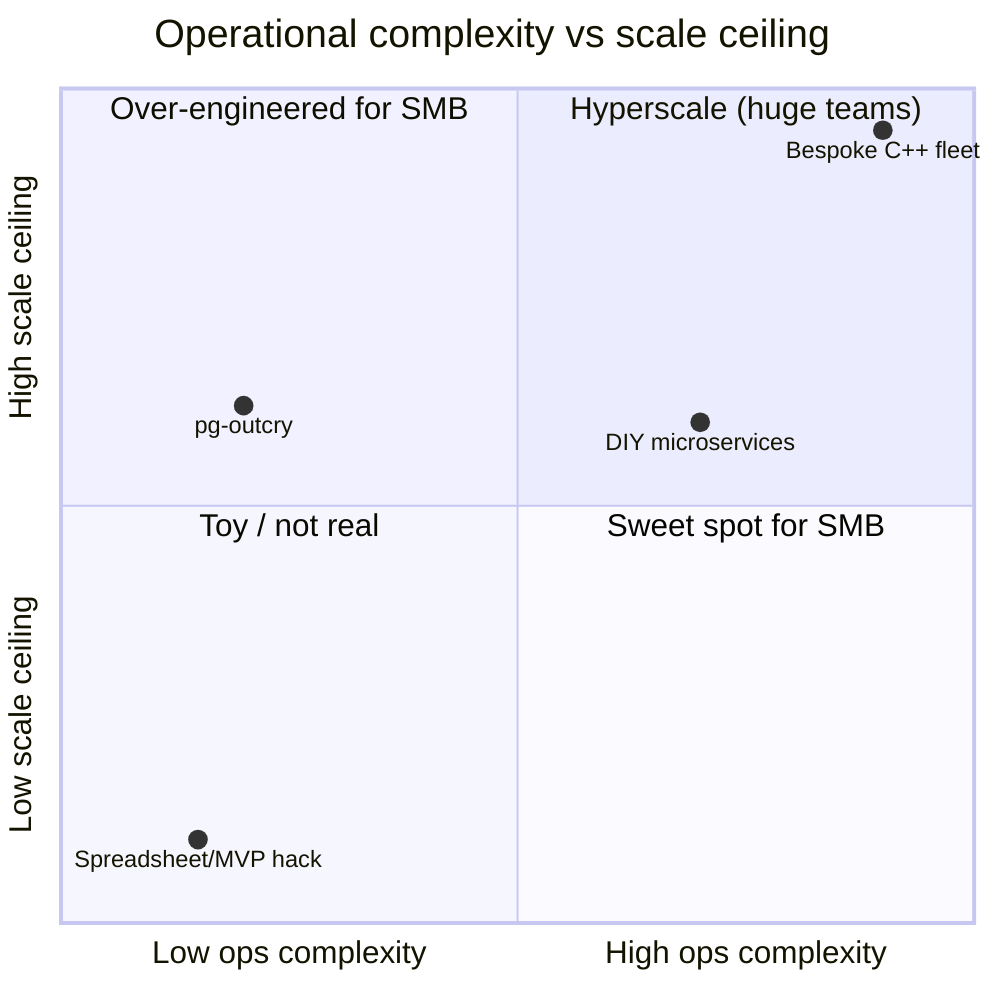

**English** · [中文](./WHY.zh-CN.md)

# Why pg-outcry

**Architecture, the top-tier-exchange comparison, and the small/mid-size-exchange advantage.**

---

### 1. Two architectures, side by side

A top-tier exchange (Binance / Coinbase / Kraken-class) is a **fleet of specialized services** wired together by a message bus, tuned for microsecond latency and millions of orders/sec.

```mermaid
flowchart TB
  subgraph TopTier["Top-tier exchange — a distributed fleet"]
    direction TB
    GW["FIX / REST / WS gateways"] --> SEQ["Sequencer"]
    SEQ --> ME["In-memory matching engine<br/>(C++, per-symbol, Disruptor)"]
    ME --> BUS{{"Message bus<br/>Kafka / Aeron"}}
    BUS --> MD["Market-data publishers"] --> WSF["WS fan-out gateways"]
    BUS --> LED["Settlement / ledger service"]
    BUS --> RSK["Risk engine"]
    BUS --> WAL["Wallet / funding service"]
    LED --> ODB[("OLTP DB")]
    WAL --> ODB
    RSK --> CACHE[("Redis cache")]
    LED --> DWH[("Warehouse")]
    ME -.journaling.-> JRNL[("Journal + snapshots<br/>for crash replay")]
  end
  style ME fill:#1c2b22,stroke:#4ef7a8
  style BUS fill:#2a1c1c,stroke:#ff5d6c
```

pg-outcry collapses that fleet into **one database plus Supabase's managed services**. The matching engine, ledger, and risk are PL/pgSQL functions; durability, ACID, and crash recovery are the database's job.

```mermaid
flowchart TB
  subgraph PG["pg-outcry — one database is the exchange"]
    direction TB
    PR["PostgREST<br/>(RPC + views)"] --> FN
    RT["Realtime<br/>(broadcast + RLS feed)"] --- WALX[("WAL")]
    AU["Auth / GoTrue"] --- DB
    subgraph DB["PostgreSQL"]
      FN["process_trade_order()<br/>match + settle in ONE ACID tx"] --> LEDG["double-entry ledger<br/>(append-only)"]
      FN --> RISK["risk checks"]
      FN --> BOOK["price_level / book_order<br/>(UNLOGGED, in-memory)"]
      LEDG --> WALX
    end
  end
  CL["Browser — WASM terminal + admin"] -->|/rpc| PR
  CL -->|md:&lt;symbol&gt; · private feed| RT
  CL -->|OAuth2| AU
  style FN fill:#1c2b22,stroke:#4ef7a8
```

---

### 2. The order lifecycle

The difference is starkest when you trace one order. The top-tier path crosses many services; **correctness becomes a distributed problem** (the trade is matched in memory, then the ledger catches up via events).

In pg-outcry the entire match **and** double-entry settlement happen inside **one database transaction**. When the RPC returns, the trade and the money have moved together — atomically — or not at all.

---

### 3. Consistency model

> At scale, the eventual-consistency window is a *feature* (throughput). For a small/mid exchange it is mostly a *liability* — it's where the "trade booked but balance wrong" support tickets and audit findings come from. pg-outcry removes the window entirely.

---

### 4. Why not their tech stack?

Each piece of a top-tier stack solves a **scale** problem. At small/mid scale it mostly adds **cost and failure surface**.

| Their component | Why it exists at scale | Why it's a liability for SMB | pg-outcry instead |
|---|---|---|---|
| **In-memory C++ engine** | µs latency, millions ops/s | needs custom journaling, snapshots, replay, failover — months of work | PL/pgSQL match; the DB gives ACID + durability + recovery for free |
| **Kafka / Aeron bus** | decouple services, replay streams | another distributed system to run; **introduces eventual consistency** | one transaction; Realtime reads the WAL |
| **Redis cache** | balances/book live outside the DB | cache-invalidation bugs; another HA system | hot data is `shared_buffers` + UNLOGGED tables in the same DB |
| **Ledger / risk / wallet microservices** | independent scaling | N deploys, N on-call, distributed transactions / sagas | functions in one schema, one transaction |
| **Bespoke authz layer** | per-tenant isolation | a whole service to build & secure | Postgres **RLS** — zero custom authz code |
| **WS fan-out fleet** | millions of subscribers | infra + scaling to operate | Supabase Realtime, RLS-scoped, managed |

**The throughput a top-tier stack buys is real — and irrelevant if you trade thousands (not millions) of orders/sec.** You'd be paying the full operational price of hyperscale to serve a fraction of the load.

---

### 5. Moving parts & failure surface

Fewer parts → fewer failure modes → fewer people on call → lower cost. Every box you don't run is a box that can't page you at 3am.

---

### 6. Cost & team to operate

A bespoke fleet sits top-right (huge scale, huge ops). pg-outcry sits in the **SMB sweet spot**: low operational complexity with a scale ceiling that comfortably covers small and mid-size venues — and a documented path to push the ceiling higher when needed (§8).

---

### 7. The small/mid-size advantage, in depth

#### 7.1 Operations & cost
One PostgreSQL + Supabase. No brokers, caches, or service mesh. Runs on a managed Supabase project or a single VM; **one or two engineers** operate the entire exchange. You pay for one system, not a fleet.

#### 7.2 Time to market
`supabase db reset` applies the schema; open the included terminal and admin console. You start with a **working exchange**, not an integration project. Days, not quarters.

#### 7.3 Correctness you didn't have to build
Double-entry ledger, fund reservation/freeze, idempotent deposits/withdrawals, single-transaction settlement, append-only ledger, per-user RLS — the financial-integrity work that sinks small teams is done and tested.

#### 7.4 Compliance & trust scaffolding

```mermaid
flowchart LR
  TX["every trade / transfer"] --> L["append-only<br/>double-entry ledger"]
  L --> R["reconcile()<br/>5 invariants"]
  ADM["admin action"] --> AUD["audit log"]
  L --> RPT["balances always<br/>re-derivable"]
  R --> OK{{"0 fails = books balance"}}
  style OK fill:#10231a,stroke:#4ef7a8
```

Append-only ledger + continuous reconciliation + admin audit log + account suspension + per-instrument risk limits = the controls auditors and banking partners ask about, built in.

#### 7.5 Realtime & UX without a team
Public market data (coalesced L2 + tape) over Broadcast; each user's private order/fill/wallet stream over RLS-scoped Postgres Changes — **no relay server, no per-user topic plumbing**. The included WASM terminal already renders candles + full TA + drawing tools client-side.

#### 7.6 Inspectable, no lock-in
Matching and settlement are plain SQL you can read, fork, and audit. No black-box engine binary, no proprietary protocol.

---

### 8. "Won't we outgrow it?" — the scaling path

You grow **along one axis at a time**, without rewrites:

```mermaid
flowchart LR
  S1["① Hosted Supabase<br/>demo → production"] --> S2["② Self-host high-perf<br/>UNLOGGED book · WAL tuning<br/>native C hot-path"]
  S2 --> S3["③ Shard by symbol<br/>1 project per symbol set<br/>stateless router"]
  S3 --> S4["④ Read replicas for<br/>market data / analytics"]
  style S1 fill:#10231a,stroke:#2a8f63
  style S2 fill:#10231a,stroke:#4ef7a8
  style S3 fill:#11202b,stroke:#5ad8ff
  style S4 fill:#1a1626,stroke:#9b8cff
```

Per-symbol concurrency is already there (advisory locks): different symbols never block each other. Because **a CEX has no cross-symbol transactions**, sharding by symbol across nodes is clean and needs **zero schema change** — each shard is the identical migration set owning a disjoint symbol set, behind a stateless router, with a shared identity/wallet plane.

---

### 9. When NOT to use this

Honesty builds trust. If you need **sub-100µs matching**, **millions of orders/sec on a single symbol**, or **co-located HFT** market structure, build a bespoke in-memory engine — that's what the top-tier stack is *for*.

pg-outcry targets the **vast majority of venues that aren't that**: regional and retail exchanges, altcoin/spot venues, brokerage matching, prediction & simulation markets, and new exchanges that need to launch correct, compliant, and cheap — then scale deliberately.

**Exchange-grade correctness, realtime, and compliance — at the complexity and cost a small team can actually carry.**

---

## How pg-outcry compares — and what it's missing

A feature comparison against three established open-source exchanges, and an honest gap analysis.

The three references are full exchange **products** (real custody, KYC, fiat). pg-outcry is a
correctness-first **engine**: the database *is* the exchange. So the gaps split into two very
different buckets — (A) external integrations every exchange bolts on regardless of architecture,
and (B) things we can add **in pure SQL** while keeping the "whole exchange in Postgres" thesis.

### Feature matrix

| Capability | [peatio](https://github.com/openware/peatio) (+Barong/Finex) | [OpenCEX](https://github.com/Polygant/OpenCEX) | [OPEX](https://github.com/opexdev/core) | **pg-outcry** |
|---|---|---|---|---|
| Matching engine | ✅ Ruby/Go | ✅ Python | ✅ Kotlin | ✅ **PL/pgSQL** |
| Double-entry ledger + reconciliation | ✅ | ✅ | ✅ (Accountant svc) | ✅ **in-DB, ACID, same tx** |
| Order types | limit/market/stop | limit/market | limit/market | ✅ limit/market/stop-loss/stop-limit · GTC/IOC/FOK |
| On-chain deposits/withdrawals | ✅ hot/warm/cold | ✅ BTC/ETH/BNB/TRX/USDT | ✅ Blockchain Gateway | ✅ **fully in-DB** — HD derivation, signing and broadcast in pure PL/pgSQL (EVM/Tron/Solana; **testnet only**, see below) ([CHAIN.md](./FEATURES.md)) |
| KYC / identity | ✅ Barong | ✅ Sumsub | ✅ Keycloak | ❌ (intentionally skipped) |
| KYT (tx screening) | — | ✅ Scorechain | — | ❌ external vendor |
| 2FA / MFA | ✅ SMS+TOTP | ✅ SMS | ✅ Keycloak | ✅ **via OAuth2 IdP** (GitHub/Google 2FA) |
| Fiat on/off-ramp | ✅ | — | — | ❌ external (payment processor) |
| Per-user API keys (HMAC) | ✅ | ◐ | ✅ | ✅ **pure SQL** |
| Referral / affiliate | — | ✅ | ✅ (Referral svc) | ✅ **pure SQL** |
| Withdrawal whitelist + limits | ✅ | ✅ | ◐ | ✅ **pure SQL** |
| Notifications (email/SMS) | ✅ | ✅ | ✅ | ◐ via Supabase triggers |
| Liquidity / market-making | via vendors | ◐ | — | ❌ demo seeder only |
| Public REST/WS market-data API | ✅ v2 + WS + AMQP | ◐ | ✅ | ◐ PostgREST + Realtime (no FIX) |
| Server-side OHLCV/candles | ✅ | ✅ | ✅ | ✅ **pure-SQL `ohlcv()` RPC** (`date_bin` buckets) |
| Admin / back-office | ✅ | ✅ | ✅ | ✅ approvals/suspend/fees/risk/recon/audit · **role-based RBAC** (config-flag demo mode) |
| Continuous reconciliation monitor | ◐ | ◐ | ✅ | ✅ **pure-SQL** `pg_cron` invariant monitor → `reconcile_alert` |
| Fee tiers (volume-based) | ✅ | ◐ | ◐ | ◐ flat maker/taker |
| Staking / margin / futures | commercial (OpenDAX) | — | — | ◐ **staking ✅ · margin ✅ · perps ✅ pure SQL** ([DERIVATIVES.md](./FEATURES.md)) |
| **Moving parts to run** | Rails + Barong + Finex + RabbitMQ + DB | Django + Redis + RabbitMQ + nodes | ~11 microservices + Kafka + Redis + N×PG | ✅ **1 Postgres + Supabase** |

### Bucket A — external integrations (every exchange bolts these on)

These are **not** a pure-SQL weakness: peatio runs a separate Barong service, OPEX a Blockchain
Gateway + Keycloak, OpenCEX wires Twilio/Sumsub/Scorechain keys. pg-outcry's bet is that the
**accounting is already correct and durable in-DB**, so you attach these at the edges and the
database stays the system-of-record.

- **Blockchain custody** — the one feature that separates "engine" from "product". It splits in two:
  - **Deposits — doable in pure Postgres.** `pg_cron` (1.6, sub-minute) + `pg_net` (outbound HTTP)
    can poll a chain RPC/explorer and credit deposits **inside the database**: a cron job calls
    `net.http_post` to a JSON-RPC node (e.g. Sepolia `eth_getLogs` for ERC-20 `Transfer`) or an
    explorer (Blockstream/mempool.space for BTC, Tronscan for TRON); a follow-up tick parses
    `net._http_response` as `jsonb` and, for each new tx **idempotent by txid** past **N
    confirmations**, runs the deposit-credit path. No external service — unlike peatio/OpenCEX/OPEX,
    which all run a separate gateway. **Use public testnets** (BTC signet, Ethereum **Sepolia**,
    TRON **Shasta**) for a free, no-real-funds demo.
  - **Withdrawals + HD address derivation — also pure Postgres now.** `pgcrypto` has no
    secp256k1/keccak, so we implemented them **in PL/pgSQL**: `00050_features_crypto.sql`
    ships keccak256 (Keccak-f[1600]) and deterministic RFC-6979 secp256k1 signing, validated
    against ethers/js-sha3; `pgsodium` covers ed25519 for Solana. On top of that,
    `00810_hd_custody` derives per-user addresses from a vault master seed, and
    `00830`/`00840`/`00900` build, sign and broadcast raw transactions (RLP+EIP-155 for EVM,
    TronGrid txID for Tron, wire format for Solana; native **and** ERC-20/TRC-20/SPL). Broadcast
    goes out over the `http` extension, which works from hosted Supabase. A full USDT
    deposit→withdraw cycle has been proven end-to-end on Tron Nile, signed entirely inside
    Postgres — no gateway, no external signer, unlike peatio/OpenCEX/OPEX.
  - **The security tradeoff is real, and it bounds this.** The master seed lives in the database,
    so compromising the database means compromising the funds. That is why the demo is
    **testnet-only** and customer funding is chain-backed by enforcement
    (`request_deposit` is disabled; `00910_chain_backed_funding_reconcile` reports and reverses
    any unbacked balance). For real value, keep the DB as the orchestrator but move key custody
    out — an HSM or a small external signer — which the send-queue design (`00720`) already
    accommodates.

- **KYC / KYT / SMS / fiat** — vendor API integrations. pg-outcry exposes the *hooks* (account
  status, tiers, limits) and you plug a vendor into the status field. KYC itself is deliberately
  **out of scope** — small/mid venues this targets often don't need vendor KYC to start.

### Bucket B — closable in pure SQL (the on-brand gaps)

Ordered by leverage. The first three are **shipped (pure SQL)** — see [DEVELOPMENT.md](./DEVELOPMENT.md):

1. **Per-user API keys (HMAC)** ✅ — bots/market-makers need programmatic auth, not interactive
   JWT. A `api_key` table + a key→short-lived-JWT exchange RPC (minted in SQL), scoped read/trade.
2. **Referral / affiliate** ✅ — OPEX dedicates a whole microservice; this is trivially pure SQL:
   referral codes, one-time attribution, commission accrued as real ledger entries.
3. **Withdrawal whitelist + limits** ✅ — address allow-list (with a cooling period) + per-window
   limits enforced in `request_withdrawal`. Today it's manual-approval only.
4. **2FA/MFA** ✅ — delegated to the OAuth2 provider (GitHub/Google enforce their own 2FA); mandate it by restricting login to OAuth (disable email/password signup). No separate TOTP to build.
5. **Notifications** — DB triggers → `pg_net`/Edge Function on fills, deposits, withdrawal status.
6. **Server-side OHLCV** ✅ — `ohlcv(instrument, resolution_s, from, to)` buckets `trade_history`
   with `date_bin` into O/H/L/C/V (epoch-aligned), anon-callable, so non-WASM clients (mobile,
   TradingView) get server-computed candles. The terminal chart now loads history from it.
7. **Volume-based fee tiers & maker rebates** — extend the flat fee model.
8. **Documented public API** — publish an OpenAPI for the PostgREST surface + the Realtime channel
   spec, so it's a *real* API, not just "views". (FIX stays out of scope.)

### Out of scope (don't chase for a spot reference exchange)

Margin / futures (advanced, see [DERIVATIVES.md](./FEATURES.md)) carry real risk and sit at the regulated end; P2P, lending, FIX protocol are different products. See
[WHY.md › when NOT to use this](./WHY.md#9-when-not-to-use-this).

### Bottom line

Blockchain custody is no longer the defining gap: derivation, signing and broadcast all run inside
Postgres and are proven on testnets. What bounds it now is the **key-custody tradeoff** (seed in the
DB ⇒ testnet only) plus the product-level items every venue bolts on (KYC/KYT/fiat). Within the pure-SQL philosophy, the
highest-leverage additions are **API keys, referral, and withdrawal security**, which reinforce
rather than dilute the "whole exchange in Postgres" story — and are now shipped (with CI smoke coverage).

---

[← Back to docs](./README.md) · [← Project README](../README.md)
