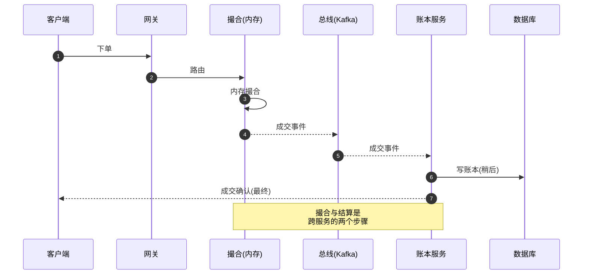
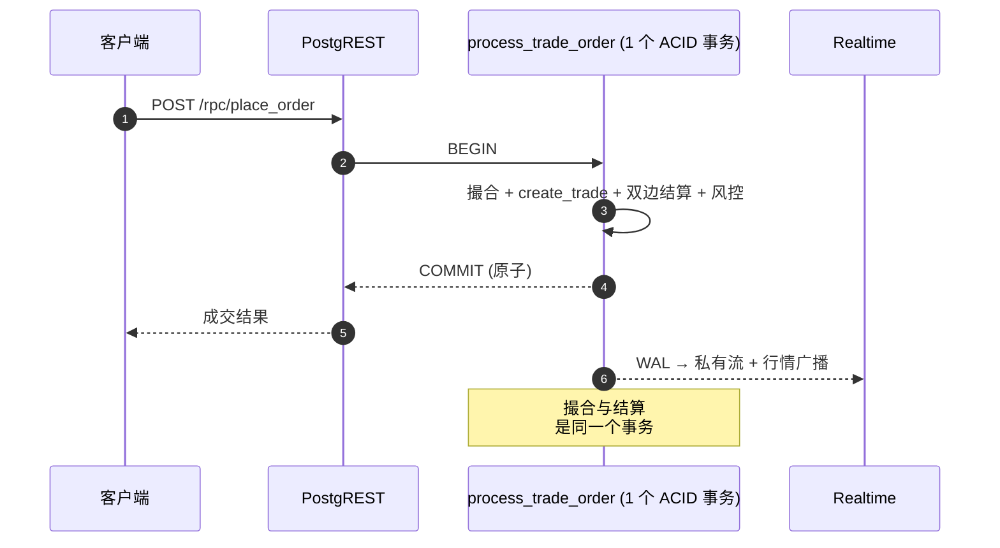
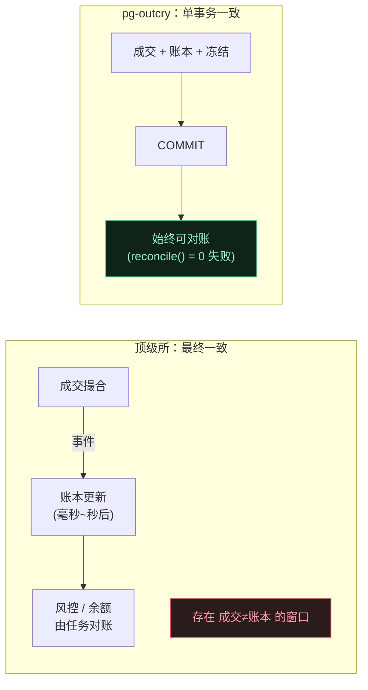
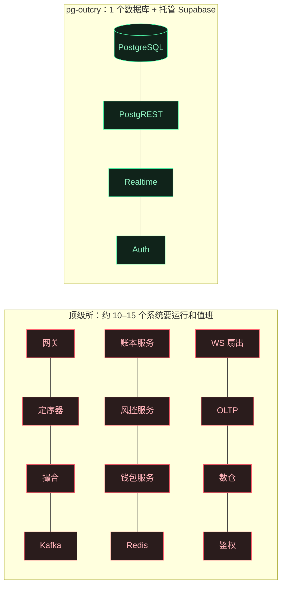
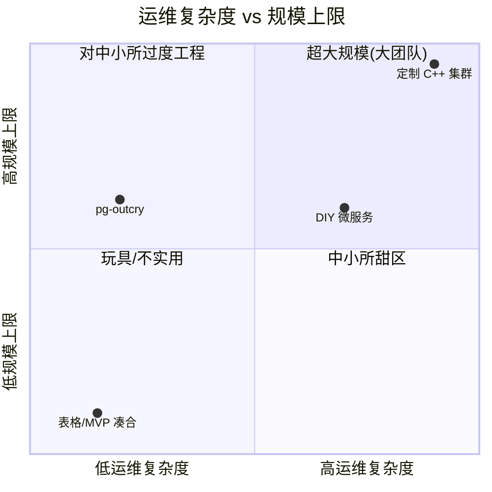

[English](./WHY.md) · **中文**

# 为什么选 pg-outcry

**架构剖析 · 与顶级交易所技术栈对比 · 中小交易所的巨大优势。**

---

### 1. 两种架构对照

顶级交易所（币安 / Coinbase / Kraken 级别）是**一支由消息总线串起来的专用服务集群**，为微秒级延迟和每秒百万级订单而生。

```mermaid
flowchart TB
  subgraph TopTier["顶级交易所 —— 分布式服务集群"]
    direction TB
    GW["FIX / REST / WS 网关"] --> SEQ["定序器 Sequencer"]
    SEQ --> ME["内存撮合引擎<br/>(C++, 按品种, Disruptor)"]
    ME --> BUS{{"消息总线<br/>Kafka / Aeron"}}
    BUS --> MD["行情发布器"] --> WSF["WS 扇出网关"]
    BUS --> LED["结算 / 账本服务"]
    BUS --> RSK["风控引擎"]
    BUS --> WAL["钱包 / 资金服务"]
    LED --> ODB[("OLTP 数据库")]
    WAL --> ODB
    RSK --> CACHE[("Redis 缓存")]
    LED --> DWH[("数仓")]
    ME -.日志.-> JRNL[("Journal + 快照<br/>用于崩溃重放")]
  end
  style ME fill:#1c2b22,stroke:#4ef7a8
  style BUS fill:#2a1c1c,stroke:#ff5d6c
```

pg-outcry 把这支集群收敛成**一个数据库 + Supabase 托管服务**。撮合、账本、风控都是 PL/pgSQL 函数；持久化、ACID、崩溃恢复交给数据库本身。

```mermaid
flowchart TB
  subgraph PG["pg-outcry —— 一个数据库就是交易所"]
    direction TB
    PR["PostgREST<br/>(RPC + 视图)"] --> FN
    RT["Realtime<br/>(广播 + RLS 私有流)"] --- WALX[("WAL")]
    AU["Auth / GoTrue"] --- DB
    subgraph DB["PostgreSQL"]
      FN["process_trade_order()<br/>撮合 + 结算 在同一个 ACID 事务"] --> LEDG["双边记账账本<br/>(只追加)"]
      FN --> RISK["风控校验"]
      FN --> BOOK["price_level / book_order<br/>(UNLOGGED, 内存)"]
      LEDG --> WALX
    end
  end
  CL["浏览器 —— WASM 终端 + 后台"] -->|/rpc| PR
  CL -->|md:&lt;symbol&gt; · 私有流| RT
  CL -->|OAuth2| AU
  style FN fill:#1c2b22,stroke:#4ef7a8
```

---

### 2. 一笔订单的生命周期

把一笔订单追下来，差别最刺眼。顶级交易所要穿过许多服务，**正确性成了分布式问题**（先在内存里撮合，账本再通过事件追上）。

在 pg-outcry 里，整个撮合**和**双边记账结算发生在**同一个数据库事务**里。RPC 一返回，成交与资金已经**原子地**一起完成 —— 要么都成，要么都不成。

---

### 3. 一致性模型

> 在大规模场景，最终一致的「窗口」是为吞吐换来的*特性*；对中小交易所它多半是*负担* —— 「成交了但余额不对」的工单和审计问题就出在这里。pg-outcry 直接消灭了这个窗口。

---

### 4. 为什么不用他们的技术栈？

顶级技术栈的每个组件都在解决**规模**问题。在中小规模，它们带来的多半是**成本与故障面**。

| 他们的组件 | 大规模为何需要 | 对中小所为何是负担 | 我们的做法 |
|---|---|---|---|
| **内存 C++ 引擎** | µs 延迟、每秒百万级 | 需要自研日志、快照、重放、故障切换 —— 数月工作量 | PL/pgSQL 撮合；数据库自带 ACID + 持久化 + 恢复 |
| **Kafka / Aeron 总线** | 服务解耦、流重放 | 又一套要运维的分布式系统；**引入最终一致** | 单事务；Realtime 直接读 WAL |
| **Redis 缓存** | 余额/盘口在库外 | 缓存失效 bug；又一套 HA 系统 | 热数据是同库内的 `shared_buffers` + UNLOGGED 表 |
| **账本/风控/钱包微服务** | 独立扩展 | N 套部署、N 班值守、分布式事务/saga | 同一 schema 内的函数、同一事务 |
| **自研鉴权层** | 多租户隔离 | 一整套要建设与加固的服务 | Postgres **RLS** —— 零自研鉴权代码 |
| **WS 扇出集群** | 百万级订阅者 | 要运维的基础设施与扩展 | 托管的 Supabase Realtime，RLS 限定 |

**顶级栈换来的吞吐是真的 —— 但当你每秒几千（而非百万）笔订单时，它毫无意义。** 你等于在用超大规模的全部运维代价，去服务很小的一部分流量。

---

### 5. 组件数与故障面

组件越少 → 故障模式越少 → 值班的人越少 → 成本越低。**你不运行的每一个盒子，都不会在凌晨三点把你叫醒。**

---

### 6. 运营成本与团队

定制集群在右上角（大规模、大运维）。pg-outcry 落在**中小所甜区**：低运维复杂度，同时其规模上限足以从容覆盖中小交易所 —— 并且有明确的提升上限的路径（见 §8）。

---

### 7. 中小交易所优势详解

#### 7.1 运维与成本
一个 PostgreSQL + Supabase。没有消息队列、缓存、服务网格。一个托管 Supabase 项目或一台 VM 即可；**一两个工程师**运营整个交易所。你为一套系统付费，而不是一支集群。

#### 7.2 上线速度
`supabase db reset` 装上 schema，打开内置终端与后台 —— 你拿到的是一个**能跑的交易所**，不是一个集成项目。按天，而非按季度。

#### 7.3 不用自己造的正确性
双边记账、资金冻结、幂等充提、单事务结算、只追加账本、用户级 RLS —— 这些能拖垮小团队的金融正确性工作，已做好并测试。

#### 7.4 合规与信任脚手架

```mermaid
flowchart LR
  TX["每笔成交 / 转账"] --> L["只追加<br/>双边记账账本"]
  L --> R["reconcile()<br/>5 条不变量"]
  ADM["管理操作"] --> AUD["审计日志"]
  L --> RPT["余额始终<br/>可重新推导"]
  R --> OK{{"0 失败 = 账平"}}
  style OK fill:#10231a,stroke:#4ef7a8
```

只追加账本 + 持续对账 + 管理审计 + 账户冻结 + 按品种风控 = 审计方与银行合作方会问到的控制项，开箱即有。

#### 7.5 没有团队也有实时与体验
公共行情（合并 L2 + 成交带）走广播；每个用户的私有订单/成交/钱包流走 RLS 限定的 Postgres Changes —— **无中继服务、无按用户布线**。内置 WASM 终端已在前端渲染蜡烛 + 全套指标 + 画线工具。

#### 7.6 可审计、无锁定
撮合与结算是你能读、能 fork、能审计的纯 SQL。没有黑盒引擎二进制、没有私有协议。

---

### 8. 「会不会很快撑不住？」—— 扩展路径

你**沿单一维度逐步扩展**，无需重写：

按 symbol 的并发已经具备（advisory lock）：不同品种互不阻塞。由于 **CEX 不存在跨 symbol 事务**，按 symbol 跨节点分片很干净、**零 schema 改动** —— 每个分片是同一套迁移、各自拥有互不相交的品种集合，前置无状态路由，共享身份/钱包平面。

---

### 9. 什么情况下别用它

诚实建立信任。如果你需要 **亚 100µs 撮合**、**单品种每秒百万级订单**、或**主机托管 HFT** 市场结构，请上定制内存引擎 —— 顶级技术栈正是*为此而生*。

pg-outcry 面向**绝大多数并非如此的场景**：区域所与零售所、山寨币/现货所、券商撮合、预测/模拟市场，以及需要「正确、合规、低成本」先上线、再有节奏地扩展的新交易所。

**交易所级的正确性、实时性与合规 —— 用小团队真正扛得住的复杂度和成本。**

---

## pg-outcry 横向对比 —— 以及我们还缺什么

与三个成熟的开源交易所做功能对比，并给出诚实的差距分析。

这三个参照物都是完整的交易所**产品**（真实托管、KYC、法币）。pg-outcry 是一个正确性优先的**引擎**：
数据库本身就是交易所。因此差距分为两类截然不同的桶 ——（A）任何架构的交易所都要在边缘集成的外部组件，
（B）我们可以**用纯 SQL**补齐、同时保持「整个交易所跑在 Postgres 里」论点的功能。

### 功能矩阵

| 能力 | [peatio](https://github.com/openware/peatio)（+Barong/Finex） | [OpenCEX](https://github.com/Polygant/OpenCEX) | [OPEX](https://github.com/opexdev/core) | **pg-outcry** |
|---|---|---|---|---|
| 撮合引擎 | ✅ Ruby/Go | ✅ Python | ✅ Kotlin | ✅ **PL/pgSQL** |
| 双边记账账本 + 对账 | ✅ | ✅ | ✅（Accountant 服务） | ✅ **库内、ACID、同一事务** |
| 订单类型 | 限价/市价/止损 | 限价/市价 | 限价/市价 | ✅ 限价/市价/止损/止损限价 · GTC/IOC/FOK |
| 链上充提 | ✅ 热/温/冷 | ✅ BTC/ETH/BNB/TRX/USDT | ✅ Blockchain Gateway | ✅ **全部在库内** —— HD 派生、签名、广播均为纯 PL/pgSQL（EVM/Tron/Solana；**仅测试网**，见下）（[CHAIN.zh-CN.md](./FEATURES.zh-CN.md)） |
| KYC / 身份 | ✅ Barong | ✅ Sumsub | ✅ Keycloak | ❌（有意跳过） |
| KYT（交易筛查） | — | ✅ Scorechain | — | ❌ 外部供应商 |
| 2FA / MFA | ✅ 短信+TOTP | ✅ 短信 | ✅ Keycloak | ✅ **委托 OAuth2 提供方**（GitHub/Google 2FA） |
| 法币出入金 | ✅ | — | — | ❌ 外部（支付处理商） |
| 用户 API key（HMAC） | ✅ | ◐ | ✅ | ✅ **纯 SQL** |
| 推荐 / 返佣 | — | ✅ | ✅（Referral 服务） | ✅ **纯 SQL** |
| 提现白名单 + 限额 | ✅ | ✅ | ◐ | ✅ **纯 SQL** |
| 通知（邮件/短信） | ✅ | ✅ | ✅ | ◐ 经 Supabase 触发器 |
| 流动性 / 做市 | 经供应商 | ◐ | — | ❌ 仅演示灌单 |
| 公共 REST/WS 行情 API | ✅ v2 + WS + AMQP | ◐ | ✅ | ◐ PostgREST + Realtime（无 FIX） |
| 服务端 OHLCV/K线 | ✅ | ✅ | ✅ | ✅ **纯 SQL `ohlcv()` RPC**（`date_bin` 分桶）|
| 管理 / 后台 | ✅ | ✅ | ✅ | ✅ 审批/冻结/费率/风控/对账/审计 · **基于角色的 RBAC**（演示模式为配置开关）|
| 持续对账监控 | ◐ | ◐ | ✅ | ✅ **纯 SQL** `pg_cron` 不变量监控 → `reconcile_alert` |
| 阶梯费率（按量） | ✅ | ◐ | ◐ | ◐ 固定 maker/taker |
| 质押 / 保证金 / 合约 | 商业版（OpenDAX） | — | — | ◐ **质押 ✅ · 保证金 ✅ · 永续 ✅ 纯 SQL**（[DERIVATIVES.zh-CN.md](./FEATURES.zh-CN.md)） |
| **要运行的组件数** | Rails + Barong + Finex + RabbitMQ + DB | Django + Redis + RabbitMQ + 节点 | 约 11 个微服务 + Kafka + Redis + N×PG | ✅ **1 个 Postgres + Supabase** |

### 桶 A —— 外部集成（任何交易所都要在边缘接上）

这些**不是**纯 SQL 的弱点：peatio 跑独立的 Barong，OPEX 用 Blockchain Gateway + Keycloak，
OpenCEX 接 Twilio/Sumsub/Scorechain 的 key。pg-outcry 的赌注是：**账本在库内已经正确且持久**，
因此你在边缘接上这些组件，数据库始终是 system-of-record。

- **区块链托管** —— 把「引擎」和「产品」区分开的那一项。它分成两半：
  - **充值 —— 纯 Postgres 可做。** `pg_cron`（1.6，支持秒级）+ `pg_net`（库内对外 HTTP）可以**在库内**
    轮询链上 RPC/浏览器并入账：cron 任务用 `net.http_post` 调 JSON-RPC 节点（如 Sepolia 的
    `eth_getLogs` 监听 ERC-20 `Transfer`）或浏览器 API（BTC 用 Blockstream/mempool.space，TRON 用
    Tronscan）；下一拍把 `net._http_response` 当 `jsonb` 解析，对每笔**按 txid 幂等**、达到 **N 个确认**的
    新交易走入账路径。无需外部服务 —— 而 peatio/OpenCEX/OPEX 都跑一个独立网关。**用公开测试网**
    （BTC signet、以太坊 **Sepolia**、TRON **Shasta**）做免费、无真实资金的演示。
  - **提现 + HD 地址派生 —— 现在也是纯 Postgres。** `pgcrypto` 没有 secp256k1/keccak，
    于是我们**用 PL/pgSQL 实现了它们**：`00050_features_crypto.sql` 提供 keccak256
    （Keccak-f[1600]）与确定性 RFC-6979 secp256k1 签名，并与 ethers/js-sha3 对拍验证；
    Solana 的 ed25519 由 `pgsodium` 提供。在此之上，`00810_hd_custody` 从 vault 主种子派生
    每用户地址，`00830`/`00840`/`00900` 构造、签名并广播原始交易（EVM 的 RLP+EIP-155、
    Tron 的 TronGrid txID、Solana 的 wire 格式；原生币**以及** ERC-20/TRC-20/SPL）。广播走
    `http` 扩展，在托管 Supabase 上可用。完整的 USDT 充值→提现闭环已在 Tron Nile 上端到端跑通，
    全程在 Postgres 内签名 —— 没有网关、没有外部签名器，这一点与 peatio/OpenCEX/OPEX 不同。
  - **安全权衡是真实的，也正是它的边界。** 主种子存在数据库里，数据库被攻破就等于资金被攻破。
    因此演示**仅限测试网**，且客户资金必须有链上背书（`request_deposit` 已禁用；
    `00910_chain_backed_funding_reconcile` 会报告并反冲任何无背书余额）。要承载真实价值，
    应保持数据库作为编排方，但把私钥托管移出去 —— HSM 或一个极小的外部签名器 ——
    出金队列的设计（`00720`）本就为此预留了接缝。

- **KYC / KYT / 短信 / 法币** —— 都是供应商 API 集成。pg-outcry 暴露*挂载点*（账户状态、等级、限额），
  你把供应商接到状态字段上即可。KYC 本身**有意不做** —— 它面向的中小交易所起步阶段往往用不到供应商 KYC。

### 桶 B —— 可以用纯 SQL 补齐（最契合本项目的差距）

按杠杆排序。前三项**已交付（纯 SQL）** —— 见 [DEVELOPMENT.zh-CN.md](./DEVELOPMENT.zh-CN.md)：

1. **用户 API key（HMAC）** ✅ —— 机器人/做市商需要程序化鉴权，而不是交互式 JWT。一张 `api_key` 表 +
   一个 key→短时 JWT 兑换 RPC（在 SQL 里签发），按 读/交易 限定范围。
2. **推荐 / 返佣** ✅ —— OPEX 为此专门做了一个微服务；这用纯 SQL 极其简单：推荐码、一次性归因、按真实账本分录计提佣金。
3. **提现白名单 + 限额** ✅ —— 地址白名单（带冷却期）+ 在 `request_withdrawal` 里按时间窗限额。目前只有人工审批。
4. **2FA/MFA** ✅ —— 委托给 OAuth2 提供方（GitHub/Google 强制自家 2FA）；如需强制，把登录限制为仅 OAuth（禁用邮箱/密码注册）即可，无需自建 TOTP。
5. **通知** —— 库内触发器 → `pg_net`/Edge Function，在成交、入金、提现状态变更时推送。
6. **服务端 OHLCV** ✅ —— `ohlcv(instrument, resolution_s, from, to)` 用 `date_bin` 把 `trade_history`
   分桶成 O/H/L/C/V（对齐 epoch）、anon 可调，让非 WASM 客户端（移动端、TradingView）也能拿到服务端
   算好的 K 线。终端图表现已从它加载历史。
7. **按量阶梯费率与 maker 返佣** —— 扩展固定费率模型。
8. **文档化的公共 API** —— 为 PostgREST 接口出一份 OpenAPI + Realtime 频道规范，使其成为*真正的* API，而不只是「视图」。
   （FIX 仍不在范围。）

### 不在范围（现货参考交易所不必追）

保证金 / 合约（进阶，见 [DERIVATIVES.zh-CN.md](./FEATURES.zh-CN.md)）带真实风险、处于受监管一端；P2P、借贷、FIX 协议是不同的产品。见
[WHY.zh-CN.md › 什么情况下别用它](./WHY.zh-CN.md#9-什么情况下别用它)。

### 结论

区块链托管已不再是最关键的差距：派生、签名、广播全部跑在 Postgres 内，并已在测试网上验证。现在真正的边界是**私钥托管的权衡**（种子在库内 ⇒ 仅测试网），以及任何交易所都要在边缘接上的产品级组件（KYC/KYT/法币）。
在纯 SQL 哲学之内，杠杆最高的补齐是 **API key、推荐返佣、提现安全**，它们强化而非稀释「整个交易所跑在 Postgres 里」
的故事 —— 也正是现已交付（并有 CI 冒烟覆盖）的内容。

---

[← 返回文档](./README.md) · [← 项目 README](../README.zh-CN.md)
